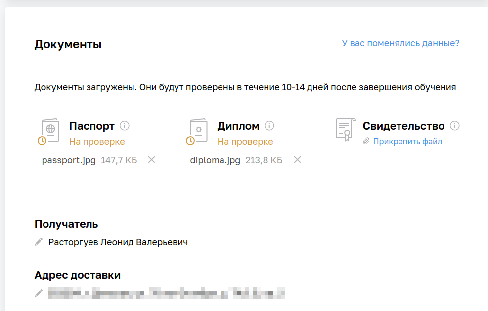

1. Получилось ли у вас загрузить в личный кабинет документы, подтверждающие личность, и диплом о высшем или среднем специальном образовании?

Да.

2. Нужна ли вам справка об обучении после сдачи диплома? Она выдаётся всем студентам, в том числе тем, у кого нет диплома о высшем или среднем специальном образовании.

Да.

3. Удалось ли вам сдать минимум 80% домашних заданий на каждом модуле профессии?

Да.
