# Конспект "Работа с git"

## Пути сохранения настроек:
- /etc/gitconfig - сохраняются настройки system. Распространяются на все репы всех пользователей ПК.
- ~/.gitconfig или ~/.config/git/config - сохраняются настройки global. Распространяются на все репы текущего пользователя ПК.
- .git/config  - сохраняются настройки local. Распространяются только на текущую репу

## Команды настроек:
Посмотреть все настройки:

`git config --list`

Посмотреть все настройки и где они заданы:

`git config --list --show-origin`

Создание псевдонима команд:

`git config --global alias.br branch`

## Команды работы с изменениями:
Краткий вывод состояний файлов репы:

`git status [-s|--short]`

Показать различия файлов между статусами Modified и Unmodified (измененные и те что в последнем коммите в репе):

`git diff`

Сравнивает Staged и Unmodified (проиндексированные и те что в последнем коммите в репе):

`git diff --staged`
`git diff --cached`

Просмотр изменений в графическом редакторе:

`git difftool`

Коммит изменений с вводом комментария в консольном редакторе:

`git commit`

* Флаг `-a` автоматически добавит файлы в индекс.
* Флаг `-m` позволяет ввести комментарий в командной строке.
* Флаг `-v` добавит в комментарий коммита какие были изменения

Пример:
`git commit -v -a -m "Что и почему было изменено"`

Добавление в индекс удаления файлов __у меня нормально добавило удаление и `git add .`__:

`git rm file.txt`
* флаг `-f` удаление файла даже если он уже проиндексирован.
* флаг `--cached` отменить индексирование удаления файла
* флаг `-n` посмотреть что буде если удалить, но ничего не делать

Удаление файлов по шаблону:

`git rm log/\*.log`

Перемещение/переименование файлов:

`git mv file.src file.dect`

### Сккрытие и восстановление изменений

`git stash` - спрятать изменения

`git stash --keep-index` - спрятать всё, кроме того что уже было добавлено в индекс командой git add

`git stash --include-untracked` - также спрятать все неотслеживаемые файлы

`git stash --patch` - запустить интерактивный режим

`git stash list` - показать список спрятанных файлов

`git stash apply` - восстановить что было спрятано

`git stash apply --index` - восстановить что было спрятано, с учетом индексирования

`git stash drop` - удалить область stash

`git stash pop` - восстановить что было спрятано и удалить область stash

`git stash branch new_branch` - создать ветку из спрятанных изменений

### Очистка рабочей директории

`git clean`

Аргументы:

* `-n` - покажет что будет удалено, но удалять не будет
* `-f` - удалит
* `-d` - также удалить директории
* `-q` - удалить тихо
* `-x` - удалить даже что в .gitignore
* `-i` - интерактивный режим

## Работа с историей коммитов

Просмотр истории коммитов

`git log`

Флаги:
* `-p` - показывает что было изменено
* `-[1|2|3|..n]` сколько последних коммитов вывести
* `--stat` - выводит статистику по каждому коммиту
* `--pretty=online` - вывести каждый коммит в 1 строку
* `--pretty=format` - вывод комментариев с форматированием
* `--abbrev-commit` - вывод хеша коммита в сокращенном виде
* `--graph` - вывод лога с вертикальным графом. Пример: `git log --pretty=format:'%h %s' --graph`

### Просмотр коммита:

`git show 62d641c` - просмотр конкретного коммита

`git show main` - последний коммит ветки

`git show v0.1` - коммит тега

`git show 8cf232d^`, `git show 8cf232d~` - коммит родителя

`git show 8cf232d^1`, `git show 8cf232d^2`- коммит n-родителя

`git show 8cf232d~3` - коммит родителя родителя родителя

Чтобы узнать SHA-1 (хеш) объекта:

`git rev-parse main`

Позволяет увидеть даже объединенные коммиты командой `--amend`:

`git reflog`

### Просмотр диапазона коммитов
`git log master..experiment` - просмотр коммитов, которые есть в ветке experiment но нет в master

Краткий лог по диапазону коммитов исключая merge-коммиты. Нижняя граница исключается, верхняя - включается:
* `git log 66236fd..01e1ae5 --no-merges --pretty=format:"%h | %ad | %an | %s%d" --date=short` - в диапазоне коммитов
* `git log v2.1.4.59..v2.1.4.60 --no-merges --pretty=format:"%h | %ad | %an | %s%d" --date=short` - в диапазоне тегов
* `git log v2.1.4.59..v2.1.4.60 --no-merges --pretty=format:"%h | %ad | %an | %s%d" --date=short > change.log` - в диапазоне тегов, с выгрузкой в файл "change.log"

Краткий лог по всем коммитам исключая merge-коммиты:
* `git log --no-merges --pretty=format:"%h | %ad | %an | %s%d" --date=short`
* `git log --no-merges --pretty=format:"%h | %ad | %an | %s%d" --date=short > change.log` - с выгрузкой в файл "change.log"

Вывод истории изменений для отчета бизнесу. Нижняя граница исключается, верхняя - включается:
* `git log 07885d5..01e1ae5 --no-merges --pretty=format:"##COMMIT##%n%h%n%ad%n%an%n%s%n%d%n%b%n##FILES##" --name-status > change.log` - в диапазоне коммитов, в файл.
* `git log v2.1.4.59..v2.1.4.60 --no-merges --pretty=format:"##COMMIT##%n%h%n%ad%n%an%n%s%n%d%n%b%n##FILES##" --name-status > change.log` - в диапазоне тегов, в файл.

## Журнал событий
* `git reflog` - просмотр журнала
* `git show HEAD@{5}` - просмотр коммита 5 шагов назад
* `git show main@{yesterday}` - просмотр последнего коммита на котором был вчера 
* `git show HEAD@{2.months.ago}` - просмотр последнего коммита на котором был 2 месяца назад
* `git log -g master` - расширеннвй вывод лога с номерами шагов

## Переход по коммитам

Перенос указателя на конкретный коммит:

`git checkout 66236fd` 

Возврат к последнему коммиту:
* `git checkout -` - после однократного перехода
* `git checkout <branch name>`

## Команды изменения истории

`git commit --amend` - Изменение последнего коммита

`git rebase -i HEAD~3` - интерактивное перебазирование коммитов начиная с 3-го предка текущей ветки

В перебазировании можно изменять порядок променения коммитов
 
Команды коммита в rebase:
* `p, pick` - применить коммит
* `r, reword` - 
* `e, edit` - изменить коммит, перебазирование на нем остановится для возможности выполнить __amend__
* `s, squash` - объединить коммит с предыдущим, перебазирование на нем остановится и выведет комментарий для исправления 
* `f, fixup` - объединить коммит с предыдущим, без остановки перебазирования, комментарий возьмется от предыдущего коммита
* `b, break ` - остановить перебазирование на этом комммите (чтобы дальше продолжить, нужно выполнить команду `git rebase --continue`)
* `d, drop` - удалить совсем коммит

## Разбиение коммитов

1. выполнить перебазирование, на теге который разбиваем - edit
2. Далее сбрасываем указатель и вводим новые коммиты

Пример:
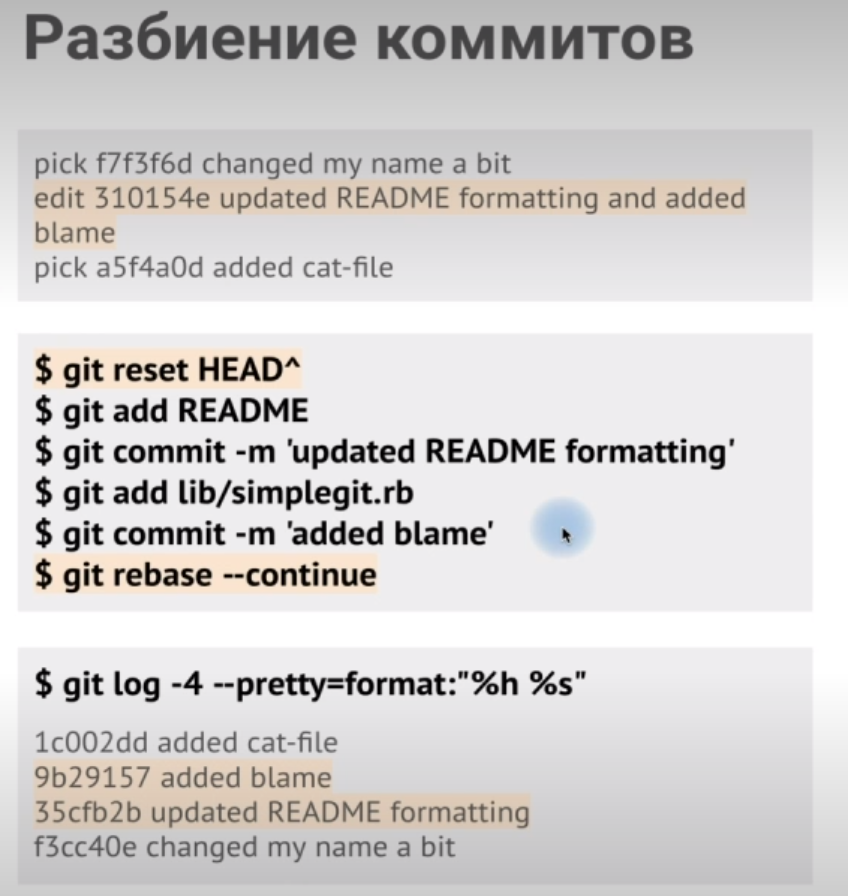

## Удаление файла из каждого коммита
`git filter-branch --tree-filter 'rm -f passwords.txt' HEAD` - удалит файл "passwords.txt" во всей истории начиная с HEAD.

команда изменить все коммиты начиная с коммита, в котором будет найден файл, поэтому всей команде потом надо будет получить репо с `git pull --force`

## Команды отмены

Отменить добавление в индекс:

`git restore --staged file.txt`

Отменить изменения в рабочем каталоге:

`git restore file.txt` или `git checkout -- file.xtx`

Отменить последний коммит слияния:
`git revert -m 1 HEAD`

Но, если потом сделать опять коммит слияния с этой веткой, то в ветку слияния попадут только те коммиты, которых раньше не было. Это плохо. Чтобы это исправить, необходимо отменить коммит отмены:
`git rever ^M`

## Разделение и объединение истории
Создаем ветку, с коммита которой произойдет разделение:
`git branch history c6e1e95`

Создаем удаленный исторический репозиторий и привязываем его к текущему:

`git remote add project-history <url_repository>`

`git push project-history history:master`

Усекаем историю:
Определяем какой коммит будет коммитом перекрытия (будет присутствовать в обоих репозиториях). В нашем примере это c6e1e95

Создаем от его родителя "сиротский коммит":

`echo 'Комментарий сиротского коммита'|git commit-tree 9c68fdc^{tree}`

Выполняем перебазирование остающихся коммитов на сиротский коммит:

`git rebase --onto 622e88 9c68fdc`

где 622e88 - это сиротский коммит

Как разработчикам подключить историческое хранилище?

`git remote add project-history <url_repository>`

`git fetch project-history`

Теперь если нужно посмотреть историю нового репозитория, то выполняем:

`git log --oneline master`

Если историю исторического репозитория, то:

`git log --oneline project-history/master`

Как объединить историю снова?

`git replace 81a708d c6e1e95`

где c6e1e95 - это коммит перекрытия из исторического хранилища, а 81a708d - его аналог из нового.

## Как подписывать коммиты

## Удаленные репозитории
Показать к каким удаленным репозиториям подключен локальный:

`git remote` или расширенная версия `git remote -v`

Подключить локальный репозизиторий к удаленному:

`git remote add [remote-name] [Удаленный_путь]`

Пример:
`git remote add 1336 git@github.com:1336/libgit2.git`

Получить изменения из удаленного репозитория:

`git fetch [remote-name]`

`git fetch --all`

Получить и слить изменения из удаленного репозитория:

`git push [remote-name] [branch-name]`

Просмотреть удаленный репозиторий

`git remote show origin`

Изменить remote-name:

`git remote rename remote-name new-remote-name`

Удалить у себя удаленный репозиторий:

`git remote rm remote-name`

Создать ветку от определенного коммита:

`git switch -c <branch_name> <tagname>`

Создать ветку от текущего коммита:

`git switch -c <branch_name>`

Удалить все отслеживаемые ветки:

`git branch -r | grep -v '\->' | while read remote; do git branch -d -r "$remote"; done`

По всем отслеживаемым веткам создать локальные:

`git branch -r | grep -v '\->' | while read remote; do git branch --track "${remote#origin/}" "$remote"; done`

Изменить связь текущей ветки с отслеживаемой:

`git branch -u origin/main`

## Работа с тегами
Теги бывают **легковесными** и **аннотированными**.

Просмотр всех тегов

`git tag`

Флаги:
* `-l` - фильтр по тегам. Пример: `git tag -l "v1"`
* `-a` - создание аннотированного тега
* `-m` - комментарий аннотированного тега
* `-d` - удаление тега в локальном репозитории

Создание аннотированного тега:

`git tag -a v0.0.1 -m "Комментарий тега"`

Создание легковесного тега:

`git tag v0.0.2`

Тегитирование существующего коммита:

`git tag -a v0.0.3 9fceb02 -m "Коммит тега"`

Просмотр информации о коммите тега:

`git show v0.0.1`

Отправка тегов в удаленный репозиторий:

`git push origin v0.0.1` или все `git push origin --tags`

Удаление тега в локальном репозитории:

`git tag -d v0.0.1`

Удаление тега в удаленном репозитории:

`git push origin --delete <tagname>`

## Поиск в Git

`git grep`

Аргументы:

* `-n` - отобразить номера строк в которых были найдены совпадения
* `-c` - показать количество совпадений в файлах
* `-p` - показать метод или функцию, в которой присутствуют совпадения
* `--and|--or|--not` - логические операторы
* `--break` - Добавить пустые строки
* `--heading` - отобразить имена файлов над группой найденных строк

`git log -SZLIB_BUF_MAX --oneline` - поиск коммитов в которых эта константа была изменена

`git log -L :func1:file2.c` - поиск всех изменений в границах функции `func1` файла `file2.c`

## Бинарный поиск

`git bisect start` - начало бинарного поиска

`git bisect bad` - указываем что текущий коммит плохой

`git bisect good v1.0` - указываем какой коммит хороший

`git bisect reset` - выход

Далее, git методом половинного деления, будет предрагать коммиты для тестирования. Нам нужно будет командами `git bisect good` или `git bisect bad` указывать какие коммиты хорошие, а какие плохие

Автоматизация:

`git bisect start <good_commit> <bad_commit>`

`git bisect run test-error.sh`

## Расширенный merge
TODO: Разобрать файлы на текст

Прерывание слияния: 
`git merge --abort` или `git reset --hard HEAD`

Игнорирование пробельных символов:
* `git merge -Xignore-all-space <branch>`
* `git merge -Xignore-space-change <branch>`

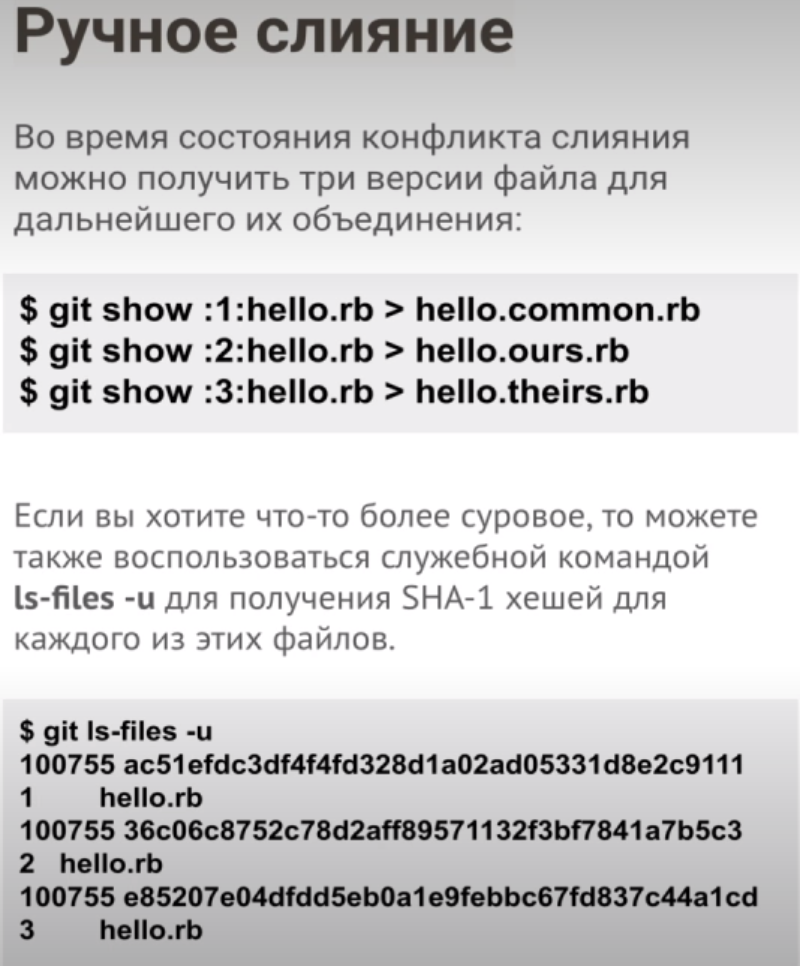
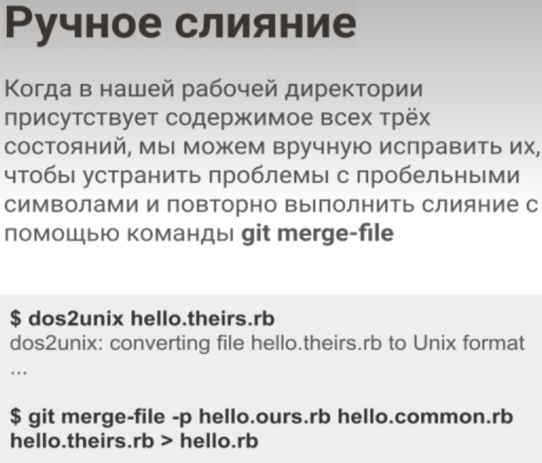
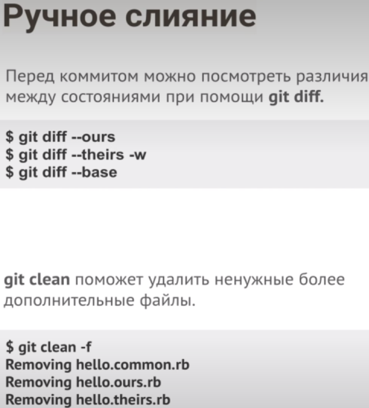

Если хотим восстановить состояние конфликта (например решили неправильно и хотим начать решать конфликт заново):

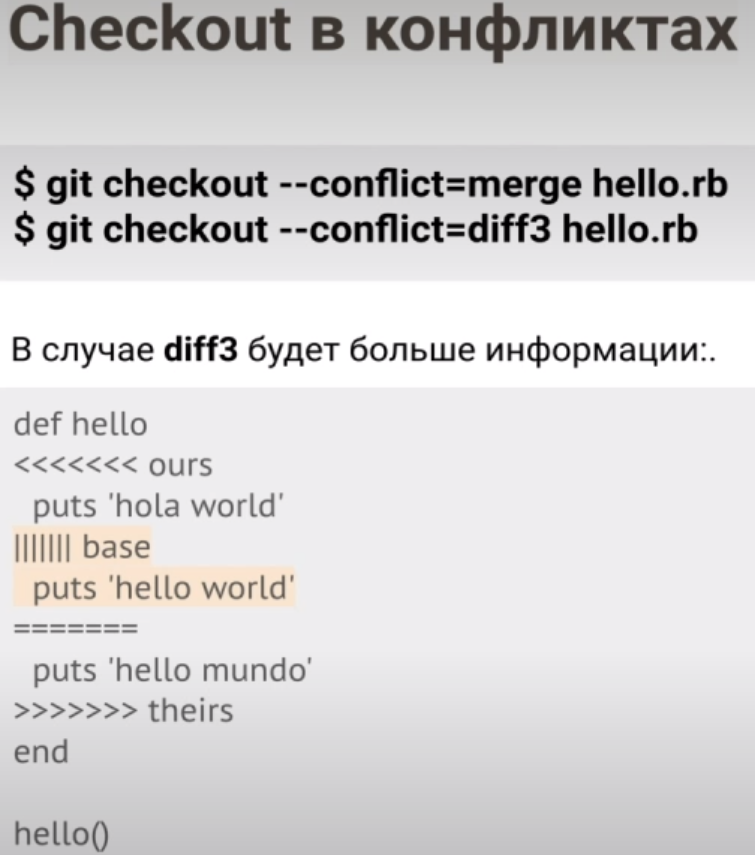

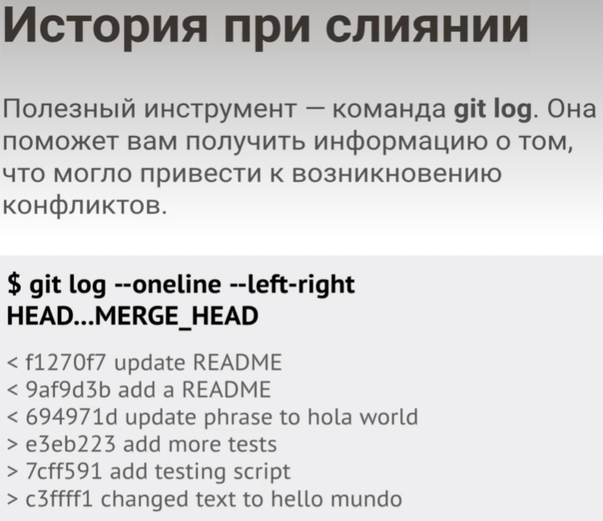

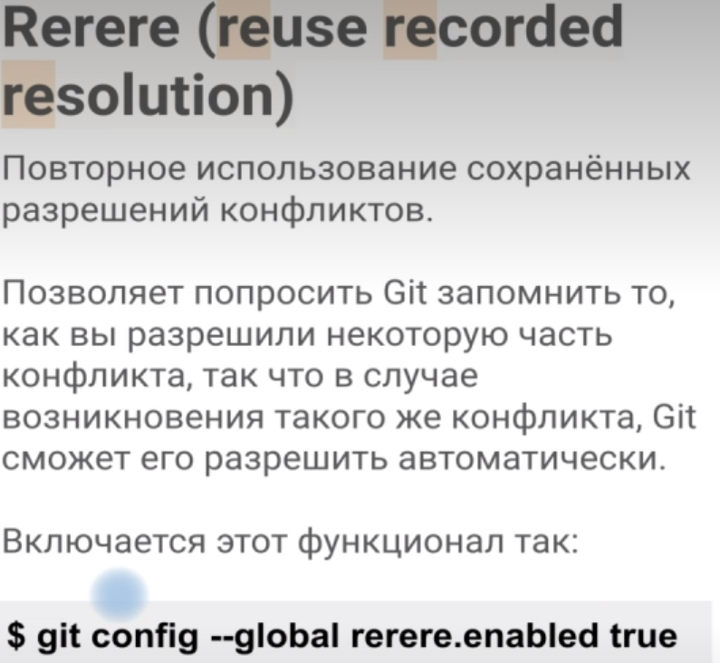
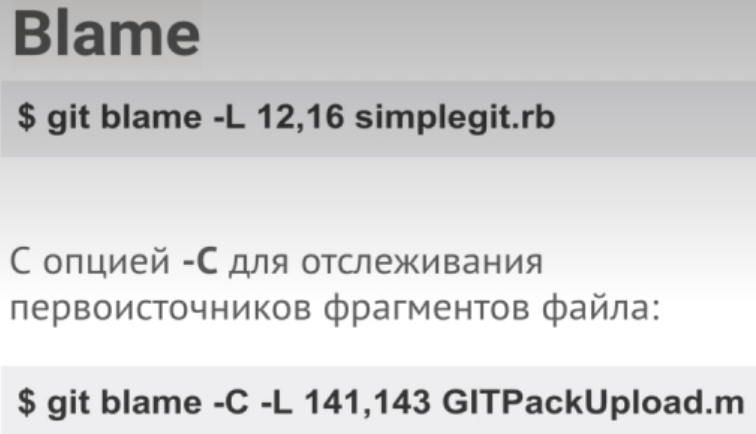
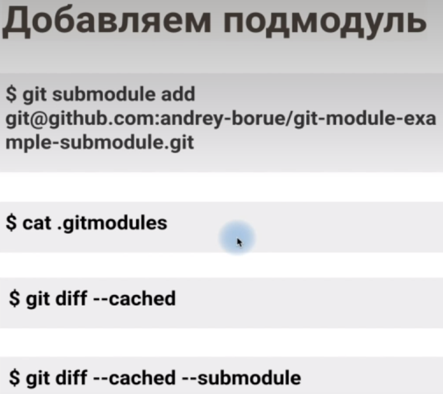
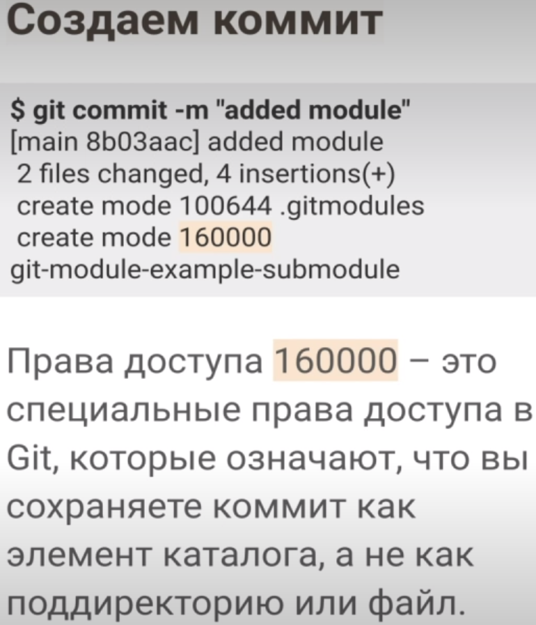
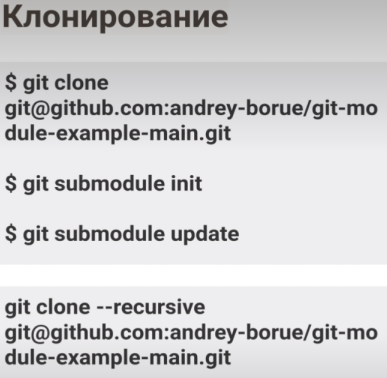
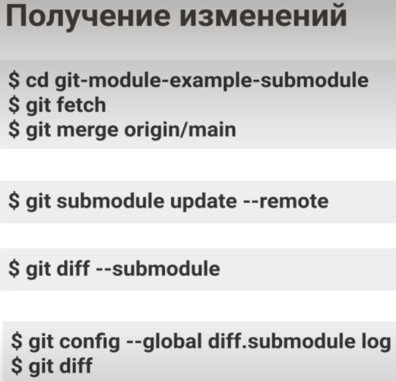
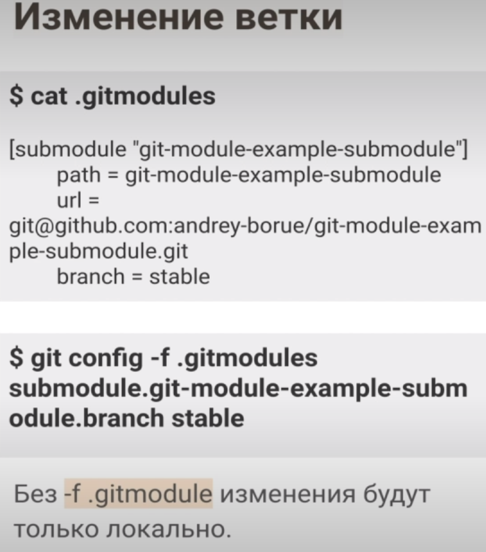
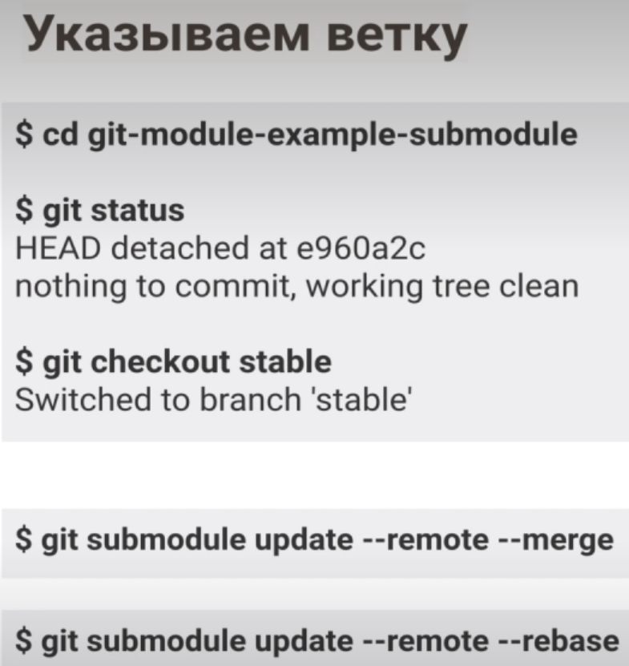
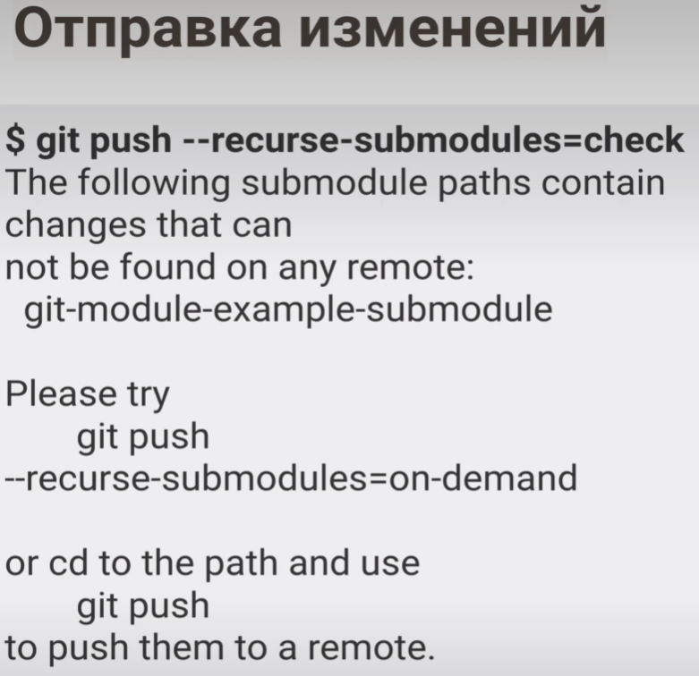

Для того чтобы выполнить команду ко всем модулям используем команду:

`git submodule foreach 'git stash'`
