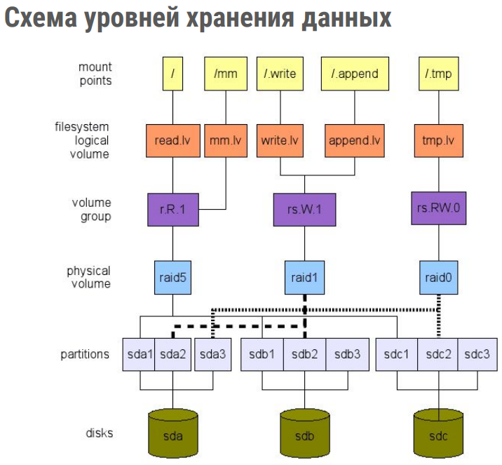

# Файловые системы
* `stat` - расширенная информация о файле
* `ls -li /usr/bin/bzip2` - вывести инфо о inode файла
* `find /usr/bin -inum 3407895` - найти все файлы по inode
* `ln test_file this_is_hardlink_for_test_file` - создать жесткую ссылку
* `ln -s $HOME/test_file test_link` - создание символической ссылки
* `chown vagrant file` - изменить владельца
* `chown :vagrant file` - изменить группу
* `chown vagrant:vagrant file`, `chown vagrant: file` - изменить владельца и группу
* `chmod 0755 file` - изменение прав доступа
* `umask` - вычитаемая маска для прав по умолчанию. Для файлов вычитается из 6, для каталогов из 7.

## Дополнительные права доступа
Полное поле атрибутов файла – 12 бит. 
Перед 9 битами пользовательских разрешений есть еще три:
* setuid
* setgid
* sticky
* 
В десятичной записи: 

setuid: 2<sup><small>2</small></sup> = 4 setgid: 2<sup><small>1</small></sup> = 2 sticky:  2<sup><small>0</small></sup> = 1

**sticky** бит используется для директорий, в которые доступна запись многим пользователям, но требуется защитить файлы от чужого вмешательства.

**setuid / setgid** имеют одинаковый механизм работы за исключением применимости к пользователю (U) или группе (G).

**setuid** - обычно этот бит можно встретить на исполняемых файлах. Пользователь, запускающий такой файл, получает процесс, работающий с правами владельца исполняемого файла (а не своими собственными). Классический пример: вызов утилиты смены пароля passwd:
```commandline
vagrant@netology1:~$ stat $(which passwd) | grep Uid
Access: (4755/-rwsr-xr-x)  Uid: (    0/    root)   Gid: (    0/    root)
```

**setgid** на директориях имеет другой эффект (setuid обычно не используется). С этим установленным битом вновь создаваемые файлы и директории наследуют группу владельца родительского каталога, а не пользователя, инициировавшего операцию.

## Дополнительные атрибуты, lsattr/chattr
Помимо стандартных 12 бит для записи разрешений в метаданных файла, могут присутствовать дополнительный атрибуты, способные ввести в затруднение тех, кто о них не знает.

* `lsattr test_file` - вывести доп атрибуты файла
* `man chattr` - полный список расширенных атрибутов
* `chattr -i test_file` - удалить атрибут "i" - immutable
* `chattr +i test_file` - добавить атрибут "i" - immutable

## LVM2


* `lsblk` - Выводит информацию о дисках и созданных на них разделах, их размерах, точке монтирования.
* `df -H` - Выводит информацию только о примонтированных файловых системах, включая те, которые не являются дисковыми разделами. В выводе отображается общий размер, использованный и доступный объем (в т.ч. в процентах), а также точка монтирования.
* `parted -l` - Позволяет получить сведения о дисках, разделах, их размерах в легко читаемом формате. Эта команда является удобным инструментом для поиска примонтированного "слепка": в примере ниже "слепок" выводится как диск /dev/vdb и имеет структуру, аналогичную диску /dev/vda.
* `fdisk -l` - Команда, близкая по функциональности к parted -l, но предоставляющая более обширный вывод разделов (с дисками /dev/ram*), что может затруднять восприятие.
* `fio` - тест производительности дисков в Linux
* `fdisk` - работа с разделами (partitions)
* `sfdisk` - снимает образ с таблицы разделов
* `sfdisk –dump /dev/sda > sda-tables.txt` - выгрузить таблицу разделов в файл
* `sfdisk /dev/sda < sda-tables.txt` - восстановить табл. разделов из файла
* `sudo sfdisk -d /dev/sdb | sudo sfdisk /dev/sdc` - копирование табл. разделов с sdb на sdc
* `blkid` - вывод информации о блочных устройствах
* `pvs`, `pvdisplay`, `pvscan` - отображение информации о физических томах LVM
* `pvcreate` - создание физического тома (physical volume)
* `pvmove` - перемещение физического тома (physical volume)
* `pvresize` - изменение размера физ. тома
* `pvremove` - удаление физ. тома
* `vgs`, `vgdisplay`, `vgscan` - отображение информации о группах томов LVM
* `vgcreate` - создание группы томов (volume group)
* `vgextend` - добавление физических томов в группу
* `vgreduce` - удаление физических томов из группы
* `vgchange` - изменение параметров группы томов, активация и деактивация
* `vgremove` - удаление группы томов
* `vgsplit` - разделение группы томов
* `vgmerge` - объединение групп томов
* `lvs`, `lvdisplay`, `lvscan` - отображение информации о логических томах LVM
* `lvcreate` - создание логического тома (logical volume)
* `pvmove` - перемещение логического тома (logical volume)
* `lvremove` - удаление лог. тома (должен быть размонтирован `umount`)
* `lvextend` - увеличение размера логических томов
* `lvreduce` - уменьшение размера лог. тома. Очень важно сначала уменьшить размер файловой системы до уменьшения размера тома. В противном случае данные могут быть потеряны.
* `mkfs` - создание файловой системы на логическом томе
* `mkfs.ext4` - создание файловой системы ext4 на логическом томе
* `sudo file -sL /dev/raid-vg/lvol0` - вывод информации о файловой системе
* монтирование раздела
```commandline
vagrant@vagrant:~$ mkdir /tmp/new
vagrant@vagrant:~$ sudo mount /dev/raid-vg/lvol0 /tmp/new
vagrant@vagrant:~$ sudo chown vagrant:vagrant /tmp/new
vagrant@vagrant:~$ stat /tmp/new | grep Uid
Access: (0755/drwxr-xr-x)  Uid: ( 1000/ vagrant)   Gid: ( 1000/ vagrant)
```

## RAID
* `mdadm` - утилита для управления программными RAID-массивами
* `cat /proc/mdstat` - статус mdadm
* `mdadm --fail /dev/md0 /dev/nvme1n1` - Искусственно пометим один из дисков сбойным

mdadm.conf - файл конфигурации

Для сохранения созданной конфигурации RAID массива выполняем команды:
```commandline
echo 'DEVICE partitions containers' > /etc/mdadm/mdadm.conf
mdadm --detail --scan >> /etc/mdadm/mdadm.conf
update-initramfs -u
```