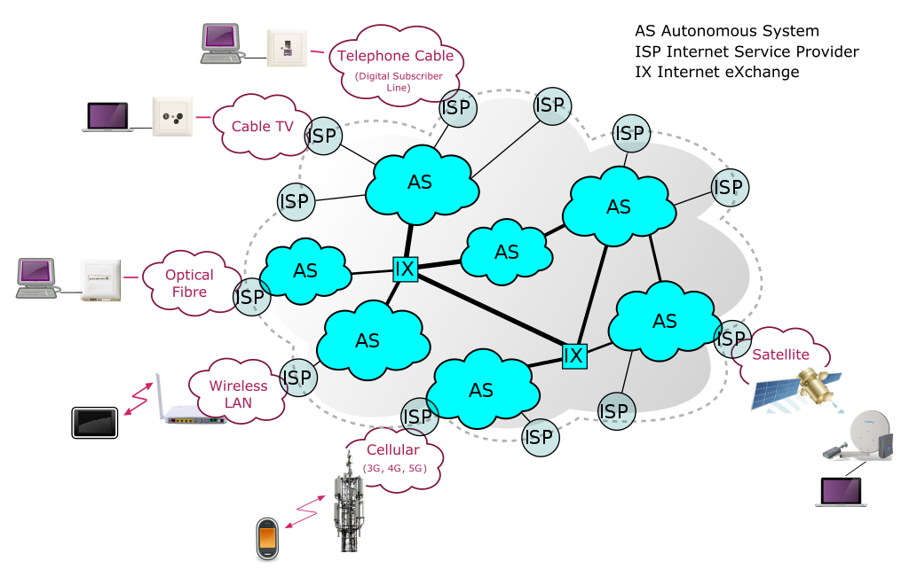
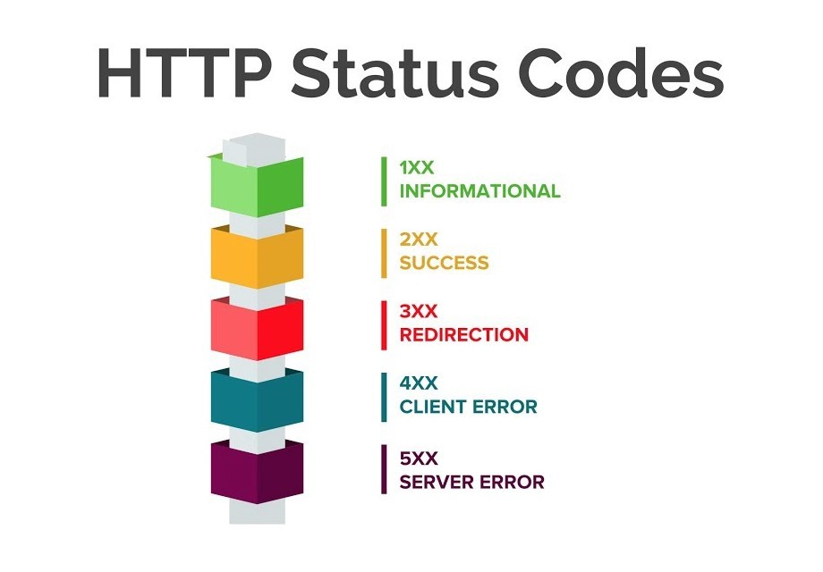

[https://whoer.net/](https://whoer.net/) - как узнать свой IP извне

* `whois 178.219.46.60`, `whois -h whois.ripe.net 178.219.46.60`, `whois -h whois.radb.net 178.219.46.60` - инфо о провайдере по IP адресу, где `whois.ripe.net` - сервер некоммерческой организации, выдающей IP адреса.
* `ip a` - инфо о сетевых интерфейсах
* `ping -I eno1 -c5 8.8.8.8` - пинг от точки eno1 (наш сетевой интерфейс) до 8.8.8.8, 5 попыток.
* `whois -h whois.radb.net -- '-i origin AS35591' | grep 'route:'` - получить список всех IP адресов, которые принадлежат определенной автономной системе.
* то же самое, но в формате для использования в скриптах.
```commandline
bgpq3 -J AS35591
policy-options {
replace:
 prefix-list NN {
    91.223.199.0/24;
    185.196.118.0/24;
 }
}

bgpq3 AS35591
no ip prefix-list NN
ip prefix-list NN permit 91.223.199.0/24
ip prefix-list NN permit 185.196.118.0/24
leonid@leonid-P85-D3:~ $
```

* `traceroute -An 8.8.8.8` - сколько точек от меня до 8.8.8.8. Опция `-A` - показывать автономные сиситемы, `-n` - скрывать доменные имена. `* * *` - потери пакетов.
* `mtr -zn 8.8.8.8` - то же самое, но удобнее, + показывает в режиме online
* `dig +trace @8.8.8.8 gmail.com`, `dig TXT +short o-o.myaddr.l.google.com @ns1.google.com` - DNS раскопки

## Типы DNS записей
* A – адрес ipv4, пример для домена plypan.com – dig plypan.com.
* AAAA – адрес ipv6, dig AAAA plypan.com.
* NS – авторизованный DNS сервер.
* CNAME – alias, например www.example.com -> example.com.
* MX – почтовый сервер, `dig MX plypan.com`.
* PTR – обратная запись, `dig -x 8.8.8.8`. возвращает DNS для данного IP.

## Основы HTTP
* `telnet google.com 80` - подключение к сайту по порту

## Cli утилиты для работы с HTTP
* `curl` - отправить запрос на сервер
apt install curl
* httpie - https://github.com/httpie/httpie
apt install httpie
* `jq` - [](https://github.com/stedolan/jq) - парсить json
apt install jq
* `yq` - [](https://github.com/kislyuk/yq) - парсить yaml (оболочка поверх jq?!)
pip3 install yq

**Опции curl**:
* `-I` - посмотреть только заголовки
* `-O` - загрузка файла `curl -O https://example.com/foo.tar.gz`
* `-k` - игнорировать ошибки сертификатов
* `-L` - двигаться за редиректом
* `-s` - не выводить лишнюю информацию
```commandline
curl -s https://www.githubstatus.com/api/v2/status.json | jq '.status, .page.updated_at'
```
