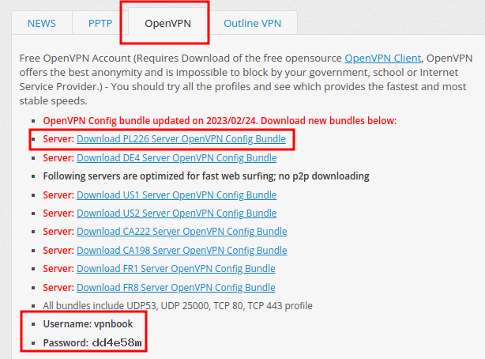
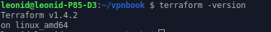
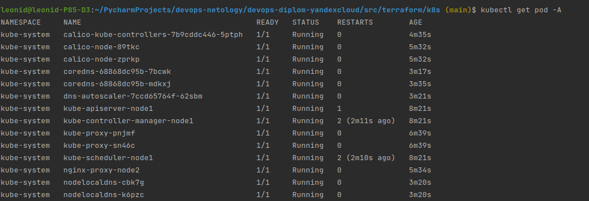

# Создание облачной инфраструктуры
Используемые версии:
terraform v1.4.2
terraform yandex provider v0.88.0
kubespray v2.21.0

## Обновляем terraform до последней версии

<details>
    <summary>Перед началом обновления terraform поднимаем free vpn.</summary>
    <p>

1. Устанавливаем OpenVpn:
```commandline
sudo apt-get install openvpn
```
2. Создаём каталог и переходим в него:
```commandline
mkdir ~/vpnbook
```
3. С [сайта](https://www.vpnbook.com/) качаем один из файлов настройки vpn в созданный каталог:


4. Настройка:
```commandline
cd ~/vpnbook

# Распаковать файлы настроек OpenVPN 
jar xvf vpnbook-openvpn-pl226.zip
rm vpnbook-openvpn-pl226.zip

# Создать файл с данными авторизации (их берём с сайта vpnbook см. скрин)
cat > auth.txt <<EOF
vpnbook
dd4e58m
EOF

# Заменить строку «auth-user-pass» на «auth-user-pass auth.txt»
sed -i 's/auth-user-pass/auth-user-pass auth.txt/' vpnbook-pl226-udp53.ovpn
```
5. Поднимаем VPN:
```commandline
sudo openvpn --config ~/vpnbook/vpnbook-pl226-udp53.ovpn
```
    </p>
</details>

Обновление terraform выполнялось по инструкции с [сайта](https://developer.hashicorp.com/terraform/downloads?product_intent=terraform)

```commandline
wget -O- https://apt.releases.hashicorp.com/gpg | gpg --dearmor | sudo tee /usr/share/keyrings/hashicorp-archive-keyring.gpg
echo "deb [signed-by=/usr/share/keyrings/hashicorp-archive-keyring.gpg] https://apt.releases.hashicorp.com $(lsb_release -cs) main" | sudo tee /etc/apt/sources.list.d/hashicorp.list
sudo apt update && sudo apt install terraform
```
### Результат:


## Предварительная подготовка к установке и запуску Kubernetes кластера.
1. создаём каталог с авторизационными данными (добавлен в .gitignore):
```commandline
mkdir ./.secrets

```
2. Создаём сервисный аккаунт:
```commandline
# Узнать список каталогов
yc resource-manager folder list

# Создать сервисный аккаунт для выбранного каталога
yc iam service-account create --name sa-terraform --folder-name new --description "this is a service account for working with terraform"

# Назначить роль editor
yc resource-manager folder add-access-binding new --role editor --subject serviceAccount:aje32701sqo6nkcbvdsp

# Создать файл авторизации
yc iam key create --folder-name new --service-account-name sa-terraform --output .key.json
```
2. Создаём статический ключ доступа:
```commandline
yc iam access-key create --folder-name new --service-account-name sa-terraform
```
3. Сохраняем данные статического ключа для дальнейшего использования при доступе к s3 bucket:
```commandline
cat > ./.secrets/backend.conf <<EOF
access_key="xxx"
secret_key="xxx"
EOF
terraform init -reconfigure -backend-config=./.secrets/backend.conf
```

<details>
    <summary>Другие варианты использования статического ключа</summary>
    <p>

1. В credetials AWS:
```commandline
mkdir ~/.aws
cat > ~/.aws/auth.txt <<EOF
[default]
aws_access_key_id="xxx"
aws_secret_access_key="xxx"
EOF
```
2. В секции backend файла backend.tf (плохой вариант):
```terraform
terraform {
  backend "s3" {
    endpoint   = "storage.yandexcloud.net"
    bucket     = "tfstate-diplom-devops"
    region     = "ru-central1"
    key        = "terraform.tfstate"
    skip_region_validation      = true
    skip_credentials_validation = true
    access_key = "xxx"
    secret_key = "xxx"
  }
}
```
2. В переменных среды:
```commandline
export AWS_ACCESS_KEY_ID="xxx"
export AWS_SECRET_ACCESS_KEY="xxx"
```
3. Передавать в параметрах выполнения команд terraform:
```commandline
terraform init -reconfigure \
    -backend-config="access_key=xxx" \
    -backend-config="secret_key=xxx"
```
    </p>
</details>

4. Создаём S3 бакет:
```commandline
yc storage bucket create --name tfstate-diplom-devops
```

## Настройка workspace
1. Создаём рабочие пространства:
```commandline
terraform workspace new stage
terraform workspace new prod
```
2. Список пространств:
```commandline
terraform workspace list
```
3. Выбираем нужное пространство:
```commandline
terraform workspace select stage
```
4. Тестируем
```commandline
terraform apply -auto-approve
terraform destroy -auto-approve
```

# Создание Kubernetes кластера.
Кластер разворачиваем с помощью Kuberspray. 
* Для `stage` окружения поднимаем: 1 control-plane и 1 node;
* Для `prod` окружения поднимаем: 3 control-plane и 3 node, в разных зонах доступности;

Доступ к k8s-инстансам будет только через nat-instance, все ВМ кластера без публичных ip.

Конфигурация Kuberspray и запуск выполняются автоматически посредством terraform, сразу после поднятия инфраструктуры.

Создаем каталог и загружаем `kubespray` <https://github.com/kubernetes-sigs/kubespray>.
```commandline
git submodule add https://github.com/kubernetes-sigs/kubespray src/vendor/kubespray
```
* Настройка хостов в ресурсе `kuberspray_inventory` файла [inventory.tf](src/terraform/app/inventory.tf);
* Старт установки реализован в файле [kubespray.tf](src/terraform/app/kubespray.tf);

Реализуем "проброс" подключения к ВМ приватной сети через nat-instance:
1. В [host.tpl](src/terraform/app/templates/hosts.tpl) добавляем секцию "bastion".
2. В [site.yml](src/ansible/site.yml) реализуем проброс "~/.kube/config", заполнение "server" и "proxy-url", ssh-туннель.

### Результат:


---
```commandline
# Первая инициализация:
terraform init -reconfigure -backend-config=./.secrets/backend.conf
terraform workspace select stage
terraform init
terraform validate
terraform plan

terraform apply -auto-approve
terraform destroy -auto-approve

ssh -D 1337 -f -C -q -N ubuntu@84.201.128.134 -p 22322
```

# Создание тестового приложения
* Создаем образ командой ```docker image build -t raleonid/app-meow:0.0.1 .```
* Запускаем контейнер командой ```docker run -d -p 8080:80 raleonid/app-meow:0.0.1```
* Проверяем
* Отправляем образ в удаленный репозиторий 

```commandline
# Авторизуемся
docker login
# Отправляем в докер-репозиторий
docker image push raleonid/app-meow:0.0.1
```
### Результат:
[Контейнер](https://hub.docker.com/repository/docker/raleonid/app-meow)

[Репозиторий тестового приложения](https://github.com/ra-leonid/app-meow)

## Подготовка cистемы мониторинга и деплой приложения

При деплое автоматически настраиваем ip адреса в файле qbec.yaml.
Настраиваем 3 окружения stage, prod и debug. debug нужен для локальной отладки на minikube. 
Окружение в файлах qbec.yaml автоматически корректируется при деплое. 
* Для debug - в makefile.
```commandline
	sed -i "/debug/,+2c\    debug:\n      defaultNamespace: debug\n      server: https://$IP_CONTROL_PLANE:8443" ./src/deploy/app/qbec.yaml
```
* Для stage и prog - Ansible. 
**TODO**: Реализовать автокорректировку окружение в файлах qbec.yaml при деплое в облако.

### Команды развертывания инфраструктуры и деплой приложений:

| Команда                               |                                      Назначение                                       |
|:--------------------------------------|:-------------------------------------------------------------------------------------:|
| make ns=debug                         | Развертывание инфраструктуры minikube и деплой namespace `debug` на локальном ПК (ВМ) |
| make                                  |            Развертывание инфраструктуры в YC и деплой в namespace `stage`             |
| make ns=stage                         |                                    Аналогично make                                    |
| make ns=prod                          |             Развертывание инфраструктуры в YC и деплой в namespace `prod`             |
| make init                             |          Инициализация terraform. Только для развертывания `stage` и `prod`           |
| make plan                             |         Получение плана terraform. Только для развертывания `stage` и `prod`          |
| make apply ns=debug                   |                  Только развертывание minikube на локальном ПК (ВМ)                   |
| make apply                            |             Только развертывание инфраструктуры в YC для `stage` и `prod`             |
| make deploy ns=<namespace>            |               Только деплой основного приложения, мониторинга, atlantis               |
| make deploy_app ns=<namespace>        |                          Только деплой основного приложения                           |
| make deploy_monitoring ns=<namespace> |                               Только деплой мониторинга                               |
| make deploy_atlantis  ns=<namespace>  |                                Только деплой atlantis                                 |
| make destroy ns=debug                 |           Деинсталяция приложений и удаление локального кластера Kubernetes           |
| make destroy                          |                              Удаление инфраструктуры YC                               |
| make delete                           |                            Только деинсталяция приложений                             |

### Настройка деплоя приложения:
Деплой приложения осуществляем посредством qbec.
1. Создаём каталог и инициализируем приложение:
```commandline
mkdir -p src/deploy/app
cd src/deploy/app
qbec init app
```
2. Описываем создание приложения в файле [app.jsonnet](src/deploy/app/components/app.jsonnet).
3. Для доступа к приложению извне, необходимо поднять 2 сервиса: [ClusterIP](src/deploy/app/components/app-svc.jsonnet) и [Ingress](src/deploy/app/components/app-web.jsonnet).
4. Параметризируем всё в [base.libsonnet](src/deploy/app/environments/base.libsonnet)

### Настройка деплоя kube-prometheus
Деплой kube-prometheus выполняем с помощью helm.
1. Создаём каталог, получаем настройки чарта:
```commandline
mkdir -p src/deploy/kube-prometheus
helm repo add prometheus-community https://prometheus-community.github.io/helm-charts
helm show values prometheus-community/kube-prometheus-stack > src/deploy/kube-prometheus/values.yaml
```
2. В настройках чарта меняем (**только указанные значения!**) в секции `grafana.ingress`:
```yaml
//...
grafana:
  ingress:
    enabled: true
//...
    hosts:
      - grafana.meow-app.ru
//...
```

Итоговый файл настроек [values.yaml](src/deploy/kube-prometheus/values.yaml).
**TODO**: Реализовать безопасное хранение пароля админа, реализовать установку с помощью qbec.

### Настройка деплоя atlantis
Деплой atlantis выполняем с помощью helm.
1. Создаём каталог, получаем настройки чарта:
```commandline
mkdir -p src/deploy/atlantis
helm repo add runatlantis https://runatlantis.github.io/helm-charts
helm show values runatlantis/atlantis > src/deploy/atlantis/values.yaml
```
2. В настройках чарта меняем (**только указанные значения!**) в секциях:
```yaml
//...
orgAllowlist: github.com/runatlantis/*
//...
github:
   user: "ra-leonid"
   token: "xxx"
   secret: "yyy"
//...
ingress:
//...
  hosts:
    - host: atlantis.meow-app.ru
      paths: ["/"]
 //...
```

Итоговый файл настроек [values.yaml](src/deploy/atlantis/values.yaml).
**TODO**: Реализовать безопасное хранение token и secret, разобраться как задается пароль админа, реализовать установку с помощью qbec.

## Установка и настройка CI/CD
1. Создаём каталог, получаем настройки чарта:
```commandline
mkdir -p src/deploy/jenkins
helm repo add jenkins https://charts.jenkins.io
helm show values jenkins/jenkins > src/deploy/jenkins/values.yaml
```
2. В настройках чарта меняем (**только указанные значения!**) в секциях:
```yaml
//...
controller:
//...
  ingress:
    enabled: true
//...
    apiVersion: "networking.k8s.io/v1"
//...
    hostName: jenkins.meow-app.ru
 //...
```
3. Команда деплоя:
```commandline
helm upgrade --install jenkins jenkins/jenkins --create-namespace -n debug -f src/deploy/jenkins/values.yaml
```
Итоговый файл настроек [values.yaml](src/deploy/atlantis/values.yaml).
**TODO**: Реализовать безопасное хранение token и secret, разобраться как задается пароль админа, реализовать установку с помощью qbec.
