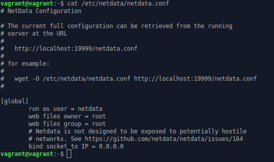
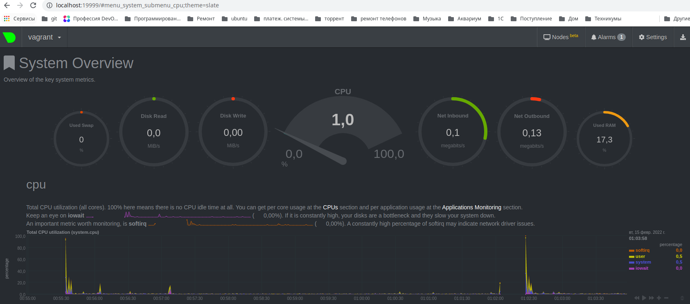
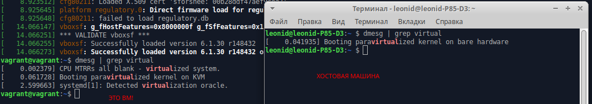

## Задание 1
Используя знания из лекции по systemd, создайте самостоятельно простой unit-файл для node_exporter:

* поместите его в автозагрузку,
* предусмотрите возможность добавления опций к запускаемому процессу через внешний файл (посмотрите, например, на systemctl cat cron),
* удостоверьтесь, что с помощью systemctl процесс корректно стартует, завершается, а после перезагрузки автоматически поднимается.

**Ответ**:
~~Схема: node_exporter будет стоять на ВМ поднятой vagrant. Prometeus ставим на хостовой машине и на неё отправляем результаты метрик~~ 
1. Установка:
```commandline
sudo apt-get update
sudo apt-get upgrade
wget https://github.com/prometheus/node_exporter/releases/download/v1.3.1/node_exporter-1.3.1.linux-amd64.tar.gz
tar xvfz node_exporter-1.3.1.linux-amd64.tar.gz
cd node_exporter-1.3.1.linux-amd64
./node_exporter
```
2. Тестовый запуск:
```commandline
vagrant@vagrant:~/node_exporter-1.3.1.linux-amd64$ ./node_exporter
ts=2022-02-14T18:18:31.282Z caller=node_exporter.go:182 level=info msg="Starting node_exporter" version="(version=1.3.1, branch=HEAD, revision=a2321e7b940ddcff26873612bccdf7cd4c42b6b6)"
ts=2022-02-14T18:18:31.282Z caller=node_exporter.go:183 level=info msg="Build context" build_context="(go=go1.17.3, user=root@243aafa5525c, date=20211205-11:09:49)"
ts=2022-02-14T18:18:31.283Z caller=filesystem_common.go:111 level=info collector=filesystem msg="Parsed flag --collector.filesystem.mount-points-exclude" flag=^/(dev|proc|run/credentials/.+|sys|var/lib/docker/.+)($|/)
...
```
3. Делаем красиво. Копируем исполняемый файл в каталог /usr/local/bin
```commandline
sudo cp ./node_exporter /usr/local/bin
```
4. Создаем служебного пользователя:
```commandline
sudo useradd --no-create-home --shell /bin/false node_exporter
```
5. Устанавливаем владельца файла:
```commandline
sudo chown node_exporter:node_exporter /usr/local/bin/node_exporter
vagrant@vagrant:~/node_exporter-1.3.1.linux-amd64$ ls -l /usr/local/bin/node_exporter
-rwxr-xr-x 1 node_exporter node_exporter 18228926 Feb 14 18:47 /usr/local/bin/node_exporter

```
6. Создание unit-файла:
```commandline
sudo vim /etc/systemd/system/node_exporter.service 
```
Вставляем текст [источник](https://github.com/prometheus/node_exporter/blob/master/examples/systemd/node_exporter.service) и немножко отсебятины:
```properties
[Unit]
Description=Node Exporter

[Service]
User=node_exporter
Group=node_exporter
EnvironmentFile=/etc/sysconfig/node_exporter
ExecStart=/usr/local/bin/node_exporter $OPTIONS
Restart=always
RestartSec=10s
NotifyAccess=all 

[Install]
WantedBy=multi-user.target
```
7. Создаем конфигурационный файл для node_exporter:
```commandline
echo OPTIONS="--collector.textfile.directory /var/lib/node_exporter/textfile_collector" | sudo tee /etc/node_exporter
sudo chown node_exporter:node_exporter /etc/node_exporter
```
8. Создаем каталог для доп. метрик:
```commandline
sudo mkdir -p /var/lib/node_exporter/textfile_collector
sudo chown node_exporter:node_exporter /var/lib/node_exporter/textfile_collector
```
8. Запуск службы:
```commandline
sudo systemctl daemon-reload
systemctl status node_exporter.service
$ systemctl status node_exporter.service
● node_exporter.service - Node Exporter
     Loaded: loaded (/etc/systemd/system/node_exporter.service; disabled; vendor preset: enabled)
     Active: inactive (dead)
$ sudo systemctl start node_exporter
$ systemctl status node_exporter.service
● node_exporter.service - Node Exporter
     Loaded: loaded (/etc/systemd/system/node_exporter.service; disabled; vendor preset: enabled)
     Active: active (running) since Mon 2022-02-14 19:28:05 UTC; 4s ago
   Main PID: 22945 (node_exporter)
      Tasks: 4 (limit: 1071)
     Memory: 2.3M
     CGroup: /system.slice/node_exporter.service
             └─22945 /usr/local/bin/node_exporter
...
$ sudo systemctl enable node_exporter
Created symlink /etc/systemd/system/multi-user.target.wants/node_exporter.service → /etc/systemd/system/node_exporter.service.
vagrant@vagrant:~/node_exporter-1.3.1.linux-amd64$ systemctl status node_exporter.service
● node_exporter.service - Node Exporter
     Loaded: loaded (/etc/systemd/system/node_exporter.service; enabled; vendor preset: enabled)
     Active: active (running) since Mon 2022-02-14 19:28:05 UTC; 1min 7s ago
...
```

8. Убеждаемся что он корректно перезагружается:
```commandline
$ sudo systemctl restart node_exporter
$ systemctl status node_exporter
● node_exporter.service - Node Exporter
     Loaded: loaded (/etc/systemd/system/node_exporter.service; enabled; vendor preset: enabled)
     Active: active (running) since Mon 2022-02-14 19:46:26 UTC; 9s ago
   Main PID: 23024 (node_exporter)
      Tasks: 4 (limit: 1071)
     Memory: 2.3M
     CGroup: /system.slice/node_exporter.service
             └─23024 /usr/local/bin/node_exporter
```

## Задание 2
Ознакомьтесь с опциями node_exporter и выводом /metrics по-умолчанию. Приведите несколько опций, которые вы бы выбрали для базового мониторинга хоста по CPU, памяти, диску и сети.
**Ответ**:

CPU:
* --collector.cpu            Enable the cpu collector (default: enabled).
* --collector.cpufreq        Enable the cpufreq collector (default: enabled).
* --collector.loadavg        Enable the loadavg collector (default: enabled).

Memory:
* --collector.meminfo        Enable the meminfo collector (default: enabled).

Disk:
* --collector.diskstats      Enable the diskstats collector (default: enabled).
* --collector.filesystem     Enable the filesystem collector (default: enabled). (Exposes filesystem statistics, such as disk space used)

Network:
* --collector.infiniband     Enable the infiniband collector (default: enabled). (Exposes network statistics specific to InfiniBand and Intel OmniPath configurations.)
* --collector.ipvs           Enable the ipvs collector (default: enabled). (Exposes IPVS status from /proc/net/ip_vs and stats from /proc/net/ip_vs_stats.)
* --collector.netclass       Enable the netclass collector (default: enabled). (Exposes network interface info from /sys/class/net/)
* --collector.netdev         Enable the netdev collector (default: enabled). (Exposes network interface statistics such as bytes transferred.)
* --collector.netstat        Enable the netstat collector (default: enabled). (Exposes network statistics from /proc/net/netstat. This is the same information as netstat -s.)
    
## Задача 3
Установил. Но секции [web] в файле уже нет:





## Задача 4
Можно ли по выводу dmesg понять, осознает ли ОС, что загружена не на настоящем оборудовании, а на системе виртуализации?

**Ответ**: Можно



## Задача 5
Как настроен sysctl fs.nr_open на системе по-умолчанию? Узнайте, что означает этот параметр. Какой другой существующий лимит не позволит достичь такого числа (ulimit --help)?

**Ответ**: 
```commandline
leonid@leonid-P85-D3:~ $ sysctl fs.nr_open
fs.nr_open = 1048576
```
Это лимит на количество открытых дескрипторов.

```commandline
leonid@leonid-P85-D3:~ $ ulimit -Sn # Мягкий лимит. Может быть изменен в процессе работы как в большую, так и в меньшую сторону
1024
leonid@leonid-P85-D3:~ $ ulimit -Hn # Жесткий лимит. Может быть изменен только в меньшую сторону
1048576
```

`ulimit -Sn` и `ulimit -Hn` не могут быть больше fs.nr_open.

## Задача 6
Запустите любой долгоживущий процесс (не ls, который отработает мгновенно, а, например, sleep 1h) в отдельном неймспейсе процессов; покажите, что ваш процесс работает под PID 1 через nsenter. Для простоты работайте в данном задании под root (sudo -i). Под обычным пользователем требуются дополнительные опции (--map-root-user) и т.д.

**Ответ**: 

1. Входим в screen
```commandline
screen
```
2. Запускаем в отдельном NS долгоживущую команду:
```commandline
root@vagrant:~# unshare -f --pid --mount-proc sleep 1h
```
3. Отключаемся от screen: 
```commandline
root@vagrant:~# screen
[detached from 1777.pts-0.vagrant]
```
4. Узнаем PID нашего процесса из хостового NS:
```commandline
root@vagrant:~# ps aux | grep sleep 1h
root        1797  0.0  0.0   7232   532 pts/1    S+   23:48   0:00 unshare -f --pid --mount-proc sleep 1h
root        1798  0.0  0.0   7228   592 pts/1    S+   23:48   0:00 sleep 1h
```
5. Выполняем команду `ps aux` в отдельном NS:
```commandline
root@vagrant:~# nsenter -t 1798 -p -m /bin/bash -c 'ps aux'
USER         PID %CPU %MEM    VSZ   RSS TTY      STAT START   TIME COMMAND
root           1  0.0  0.0   7228   592 pts/1    S+   23:48   0:00 sleep 1h
root           2  0.0  0.3  10616  3360 pts/0    R+   23:53   0:00 ps aux
```

## Задача 7
Найдите информацию о том, что такое :(){ :|:& };:. Запустите эту команду в своей виртуальной машине Vagrant с Ubuntu 20.04 (это важно, поведение в других ОС не проверялось). Некоторое время все будет "плохо", после чего (минуты) – ОС должна стабилизироваться. Вызов dmesg расскажет, какой механизм помог автоматической стабилизации. Как настроен этот механизм по-умолчанию, и как изменить число процессов, которое можно создать в сессии?

**Ответ**: Это fork bomb. Представляет собой атаку типа «отказ в обслуживании» , при которой процесс постоянно воспроизводит себя, чтобы истощить доступные системные ресурсы, замедляя или приводя к сбою системы из-за нехватки ресурсов.

Классическим примером форк-бомбы является оболочка Unix `:(){ :|:& };:` которую проще понять как:

```commandline
fork() {
    fork | fork &
}
fork
```
В нем функция определяется ( fork()) как вызывающая сама себя ( fork), а затем передает ( |) свой результат в фоновое задание самой себя ( &).

После запуска на ВМ, посыпались сообщения:
```commandline
-bash: fork: retry: Resource temporarily unavailable
-bash: fork: retry: Resource temporarily unavailable
-bash: fork: retry: Resource temporarily unavailable
```

Этот механизм помог стабилизироваться:
```commandline
vagrant@vagrant:~$ dmesg -T | grep fork
[Tue Feb 15 00:12:13 2022] cgroup: fork rejected by pids controller in /user.slice/user-1000.slice/session-3.scope
```

Поскольку режим работы форк-бомбы полностью инкапсулирован путем создания новых процессов, один из способов предотвратить серьезное влияние форк-бомбы на всю систему — ограничить максимальное количество процессов, которыми может владеть один пользователь. В Linux это можно сделать с помощью утилиты ulimit ; например, команда `ulimit -u 30` ограничит затронутого пользователя максимум тридцатью собственными процессами (по умолчанию процессов 63555).