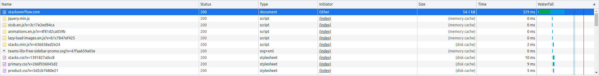
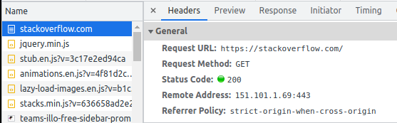
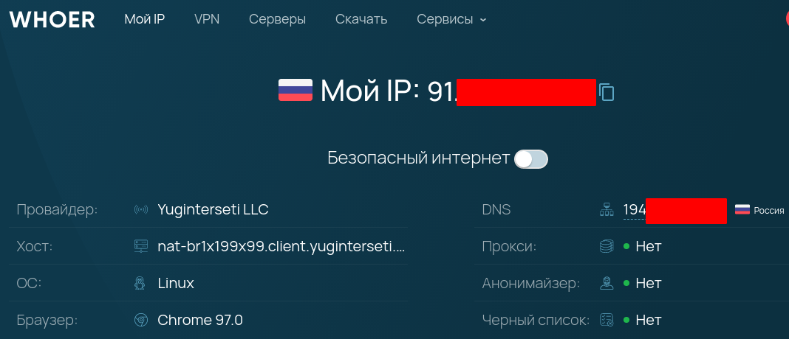
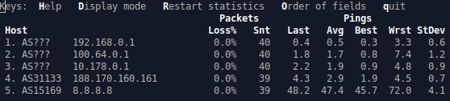

## Задание 1.
Работа c HTTP через телнет.
* Подключитесь утилитой телнет к сайту stackoverflow.com `telnet stackoverflow.com 80`
* отправьте HTTP запрос
```html
GET /questions HTTP/1.0
HOST: stackoverflow.com
[press enter]
[press enter]
```
* В ответе укажите полученный HTTP код, что он означает?

**Ответ**: 301 - "перемещен навсегда". Это редирект на **https**://stackexchange.com
```commandline
$ telnet stackoverflow.com 80
Trying 151.101.1.69...
Connected to stackoverflow.com.
Escape character is '^]'.
GET /questions HTTP/1.0
HOST: stackoverflow.com

HTTP/1.1 301 Moved Permanently
cache-control: no-cache, no-store, must-revalidate
location: https://stackoverflow.com/questions
x-request-guid: 01a6f5d1-0300-4aa5-bd80-2bb035eba55b
feature-policy: microphone 'none'; speaker 'none'
content-security-policy: upgrade-insecure-requests; frame-ancestors 'self' https://stackexchange.com
Accept-Ranges: bytes
Date: Sat, 19 Feb 2022 20:50:45 GMT
Via: 1.1 varnish
Connection: close
X-Served-By: cache-hhn4041-HHN
X-Cache: MISS
X-Cache-Hits: 0
X-Timer: S1645303845.123842,VS0,VE170
Vary: Fastly-SSL
X-DNS-Prefetch-Control: off
Set-Cookie: prov=c5e73e1b-c73f-e43d-f5d5-321566394ce6; domain=.stackoverflow.com; expires=Fri, 01-Jan-2055 00:00:00 GMT; path=/; HttpOnly

Connection closed by foreign host.
```

## Задание 2 
Повторите задание 1 в браузере, используя консоль разработчика F12.
* откройте вкладку Network
* отправьте запрос http://stackoverflow.com
* найдите первый ответ HTTP сервера, откройте вкладку Headers
* укажите в ответе полученный HTTP код.
* проверьте время загрузки страницы, какой запрос обрабатывался дольше всего?
* приложите скриншот консоли браузера в ответ.

**Ответ**: Код 200 - "Ок".



Дольше всех выполнялся первый запрос, 329ms



## Задание 3
Какой IP адрес у вас в интернете?

**Ответ**:



## Задание 4
Какому провайдеру принадлежит ваш IP адрес? Какой автономной системе AS? Воспользуйтесь утилитой whois

**Ответ**: автономная сеть AS35591, провайдер - Auction LLC. Но сервис whoer возвращает верного провайдера. Возможно мой провайдер арендует у них адреса.
```commandline
organisation:   ORG-AL729-RIPE
org-name:       Auction LLC
country:        RU
org-type:       LIR
address:        ul. Khersonskaya, d. 5, korp. 2, office 1-I-7-84
address:        117461
address:        Moscow
address:        RUSSIAN FEDERATION
phone:          +7 925 193 3834
...
origin:         AS35591
```

## Задание 5
Через какие сети проходит пакет, отправленный с вашего компьютера на адрес 8.8.8.8? Через какие AS? Воспользуйтесь утилитой traceroute

**Ответ**: 
* `192.168.0.0` - моя локальная сеть
* `100.64.0.0` - сеть в интернет
* `10.178.0.0` - опять локалка, почему!!!
* `188.170.0` - автономная сеть AS31133
* `8.8.8.8` - адрес назначения и автономная сеть AS15169
```commandline
$ traceroute -An 8.8.8.8
traceroute to 8.8.8.8 (8.8.8.8), 30 hops max, 60 byte packets
 1  192.168.0.1 [*]  0.460 ms  0.456 ms  0.409 ms
 2  100.64.0.1 [*]  2.720 ms  2.677 ms  2.634 ms
 3  10.178.0.1 [*]  2.744 ms  2.702 ms  2.761 ms
 4  188.170.160.161 [AS31133]  4.197 ms  4.154 ms  4.367 ms
 5  8.8.8.8 [AS15169]  49.589 ms  50.369 ms  49.635 ms
```

## Задание 6
Повторите задание 5 в утилите mtr. На каком участке наибольшая задержка - delay?

**Ответ**: на 5-м 8.8.8.8 - 48.2ms



## Задание 7
Какие DNS сервера отвечают за доменное имя dns.google? Какие A записи? воспользуйтесь утилитой dig

**Ответ**: 
```commandline
dig +trace dns.google
...
dns.google.		10800	IN	NS	ns2.zdns.google.
dns.google.		10800	IN	NS	ns3.zdns.google.
dns.google.		10800	IN	NS	ns4.zdns.google.
dns.google.		10800	IN	NS	ns1.zdns.google.
```
А-записи:
```commandline
...
dns.google.		900	IN	A	8.8.4.4
dns.google.		900	IN	A	8.8.8.8
```
## Задание 8
Проверьте PTR записи для IP адресов из задания 7. Какое доменное имя привязано к IP? воспользуйтесь утилитой dig

**Ответ**: dns.google. 
```commandline
$ dig -x 8.8.8.8
...
;; ANSWER SECTION:
8.8.8.8.in-addr.arpa.	19833	IN	PTR	dns.google.

$ dig -x 8.8.4.4
...
;; ANSWER SECTION:
4.4.8.8.in-addr.arpa.	57492	IN	PTR	dns.google.

```