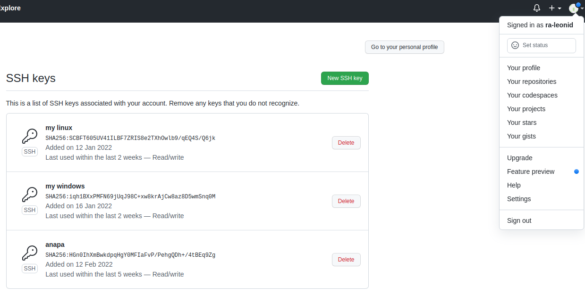

## Задание 1
Установите Bitwarden плагин для браузера. Зарегестрируйтесь и сохраните несколько паролей.

**Ответ**:


## Задание 2
Установите Google authenticator на мобильный телефон. Настройте вход в Bitwarden акаунт через Google authenticator OTP.

**Ответ**:


## Задание 3
Установите apache2, сгенерируйте самоподписанный сертификат, настройте тестовый сайт для работы по HTTPS.

**Ответ**: apache2 я уже ставил и настраивал обратный прокси c использованием ssh, неинтересно повторяться. Поэтому это задание проделал с nginx.

Настроим ВМ, чтобы к ней был доступ из хостовой машины: 
```commandline
~$ cd vagrant/
~$ mkdir nginx
~$ cd nginx
~$ vagrant init bento/ubuntu-20.04
~$ vim Vagrantfile
config.vm.network "private_network", ip: "192.168.33.10"
~$ vagrant up
~$ vagrant ssh
```
Установим Nginx:
```commandline
~$ sudo apt update
~$ sudo apt upgrade
~$ sudo apt install nginx
~$ sudo ufw app list
Available applications:
  Nginx Full
  Nginx HTTP
  Nginx HTTPS
  OpenSSH
~$ sudo ufw allow 'Nginx HTTPS'
~$ systemctl status nginx
● nginx.service - A high performance web server and a reverse proxy server
     Loaded: loaded (/lib/systemd/system/nginx.service; enabled; vendor preset: enabled)
     Active: active (running) since Sun 2022-03-13 12:18:12 UTC; 11min ago
       Docs: man:nginx(8)
   Main PID: 1880 (nginx)
      Tasks: 3 (limit: 1107)
     Memory: 6.7M
     CGroup: /system.slice/nginx.service
             ├─1880 nginx: master process /usr/sbin/nginx -g daemon on; master_process on;
             ├─1881 nginx: worker process
             └─1882 nginx: worker process
```
Создадим самоподписной сертификат:
```commandline
~$ sudo openssl req -x509 -nodes -days 365 -newkey rsa:2048 -keyout /etc/ssl/private/nginx-selfsigned.key -out /etc/ssl/certs/nginx-selfsigned.crt
```
Создадим специальные ключи Диффи-Хеллмана для поддержки PFS:
```commandline
~$ sudo openssl dhparam -out /etc/ssl/certs/dhparam.pem 2048
```
Корректируем настройки Nginx:
```commandline
~$ sudo vim sites-enabled/default 
```
```commandline
# generated 2022-03-13, Mozilla Guideline v5.6, nginx 1.17.7, OpenSSL 1.1.1k, intermediate configuration
# https://ssl-config.mozilla.org/#server=nginx&version=1.17.7&config=intermediate&openssl=1.1.1k&guideline=5.6
server {
    listen 80 default_server;
    listen [::]:80 default_server;

    location / {
        return 301 https://$host$request_uri;
    }
}

server {
    listen 443 ssl http2;
    listen [::]:443 ssl http2;

    ssl_certificate /etc/ssl/certs/nginx-selfsigned.crt;
    ssl_certificate_key /etc/ssl/private/nginx-selfsigned.key;
    ssl_session_timeout 1d;
    ssl_session_cache shared:MozSSL:10m;  # about 40000 sessions
    ssl_session_tickets off;

    # curl https://ssl-config.mozilla.org/ffdhe2048.txt > /etc/ssl/certs/dhparam.pem
    ssl_dhparam /etc/ssl/certs/dhparam.pem;

    # intermediate configuration
    ssl_protocols TLSv1.2 TLSv1.3;
    ssl_ciphers ECDHE-ECDSA-AES128-GCM-SHA256:ECDHE-RSA-AES128-GCM-SHA256:ECDHE-ECDSA-AES256-GCM-SHA384:ECDHE-RSA-AES256-GCM-SHA384:ECDHE-ECDSA-CHACHA20-POLY1305:ECDHE-RSA-CHACHA20-POLY1305:DHE-RSA-AES128-GCM-SHA256:DHE-RSA-AES256-GCM-SHA384;
    ssl_prefer_server_ciphers off;

    # HSTS (ngx_http_headers_module is required) (63072000 seconds)
    add_header Strict-Transport-Security "max-age=63072000" always;

    # OCSP stapling
    ssl_stapling on;
    ssl_stapling_verify on;

    # verify chain of trust of OCSP response using Root CA and Intermediate certs
    #ssl_trusted_certificate /path/to/root_CA_cert_plus_intermediates;

    # replace with the IP address of your resolver
    resolver 127.0.0.1;
}
```
Перезапускаем Nginx:
```commandline
sudo systemctl restart nginx
```


## Задание 4
Проверьте на TLS уязвимости произвольный сайт в интернете (кроме сайтов МВД, ФСБ, МинОбр, НацБанк, РосКосмос, РосАтом, РосНАНО и любых госкомпаний, объектов КИИ, ВПК ... и тому подобное).

**Ответ**:


## Задание 5
Установите на Ubuntu ssh сервер, сгенерируйте новый приватный ключ. Скопируйте свой публичный ключ на другой сервер. Подключитесь к серверу по SSH-ключу.

**Ответ**:



## Задание 6
Переименуйте файлы ключей из задания 5. Настройте файл конфигурации SSH клиента, так чтобы вход на удаленный сервер осуществлялся по имени сервера.

**Ответ**:
```commandline
touch ~/.ssh/config
chmod 600 ~/.ssh/config
vim ~/.ssh/config
Host github
        Hostname github.com
        IdentityFile ~/.ssh/id_ed25519.pub
        User ra-leonid
```

## Задание 7
Соберите дамп трафика утилитой tcpdump в формате pcap, 100 пакетов. Откройте файл pcap в Wireshark.

**Ответ**:
```commandline
~$ sudo tcpdump -c 100 -i eno1 -w ~/0001.pcap
tcpdump: listening on eno1, link-type EN10MB (Ethernet), capture size 262144 bytes
100 packets captured
105 packets received by filter
0 packets dropped by kernel
```


## Задание 8
Просканируйте хост scanme.nmap.org. Какие сервисы запущены?

**Ответ**: 
* OpenSSH 6.6.1p1 Ubuntu 2ubuntu2.13 (Ubuntu Linux; protocol 2.0)
* Apache httpd 2.4.7 ((Ubuntu)
* Nping
* ещё что-то на порту 31337/tcp. tcpwrapped — это спецправило Nmap, и срабатывает оно тогда, когда сервер обрывает подключение до того, как данные были отправлены.

```commandline
nmap -sV scanme.nmap.org
Starting Nmap 7.80 ( https://nmap.org ) at 2022-03-13 21:49 +03
Nmap scan report for scanme.nmap.org (45.33.32.156)
Host is up (0.22s latency).
Other addresses for scanme.nmap.org (not scanned): 2600:3c01::f03c:91ff:fe18:bb2f
Not shown: 996 closed ports
PORT      STATE SERVICE    VERSION
22/tcp    open  ssh        OpenSSH 6.6.1p1 Ubuntu 2ubuntu2.13 (Ubuntu Linux; protocol 2.0)
80/tcp    open  http       Apache httpd 2.4.7 ((Ubuntu))
9929/tcp  open  nping-echo Nping echo
31337/tcp open  tcpwrapped
Service Info: OS: Linux; CPE: cpe:/o:linux:linux_kernel

Service detection performed. Please report any incorrect results at https://nmap.org/submit/ .
Nmap done: 1 IP address (1 host up) scanned in 21.36 seconds
```

## Задание 9
Установите и настройте фаервол ufw на web-сервер из задания 3. Откройте доступ снаружи только к портам 22,80,443

**Ответ**: 

До:
```commandline
leonid@leonid-P85-D3:~/.ssh $ nmap -sV 192.168.33.10
Starting Nmap 7.80 ( https://nmap.org ) at 2022-03-13 22:15 +03
Nmap scan report for 192.168.33.10
Host is up (0.00044s latency).
Not shown: 999 filtered ports
PORT    STATE SERVICE  VERSION
443/tcp open  ssl/http nginx 1.18.0 (Ubuntu)
Service Info: OS: Linux; CPE: cpe:/o:linux:linux_kernel
```

Активируем фаерволл и открываем порты:
```commandline
vagrant@vagrant:/etc/nginx$ sudo ufw status
Status: inactive
vagrant@vagrant:/etc/nginx$ sudo ufw enable
Command may disrupt existing ssh connections. Proceed with operation (y|n)? y
Firewall is active and enabled on system startup
vagrant@vagrant:/etc/nginx$ sudo ufw status
Status: active

To                         Action      From
--                         ------      ----
Nginx HTTPS                ALLOW       Anywhere                  
Nginx HTTPS (v6)           ALLOW       Anywhere (v6)             
```

Укажем политику по умолчанию. Все входящие пакеты, не попадающие под созданные правила ufw, будем отклонять, а все исходящие разрешим:
```commandline
sudo ufw default deny incoming
sudo ufw default allow outgoing
```
Открываем нужные порты:
```commandline
sudo ufw allow 'Nginx HTTP'
sudo ufw allow 'Nginx HTTPS'
sudo ufw allow OpenSSH
```

Проверяем извне:
```commandline
leonid@leonid-P85-D3:~/.ssh $ nmap -sV 192.168.33.10
Starting Nmap 7.80 ( https://nmap.org ) at 2022-03-13 22:39 +03
Nmap scan report for 192.168.33.10
Host is up (0.00064s latency).
Not shown: 997 filtered ports
PORT    STATE SERVICE  VERSION
22/tcp  open  ssh      OpenSSH 8.2p1 Ubuntu 4ubuntu0.4 (Ubuntu Linux; protocol 2.0)
80/tcp  open  http     nginx 1.18.0 (Ubuntu)
443/tcp open  ssl/http nginx 1.18.0 (Ubuntu)
Service Info: OS: Linux; CPE: cpe:/o:linux:linux_kernel

Service detection performed. Please report any incorrect results at https://nmap.org/submit/ .
Nmap done: 1 IP address (1 host up) scanned in 16.68 seconds
```