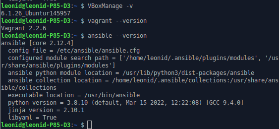
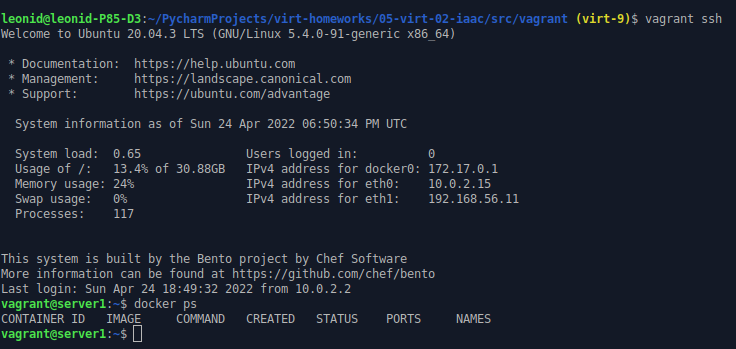

## Задача 1
Опишите своими словами основные преимущества применения на практике IaaC паттернов.
Какой из принципов IaaC является основополагающим?

**Ответ**:
1. Идемпотентность. Сколько бы мы раз не собирали инфраструктуру, не важно (надеюсь) на каком гипервизоре, результат будет всегда одинаковый. Мы можем взять передать код сборки тестовой среды разработчику и он на своем железе сможет собрать идентичную среду.
2. Стабильность среды ПО в проде, тесте и в разработке.
3. Продукт быстрее разрабатывается и выводится на рынок. М не тратим время на повторные ручные настройки инфраструктуры, разбирательства с её дрейфом и различием в поведении ПО в тесте и на проде.

## Задача 2
* Чем Ansible выгодно отличается от других систем управление конфигурациями?
* Какой, на ваш взгляд, метод работы систем конфигурации более надёжный push или pull?

**Ответ**:

Ansible это самый простой и доступный инструмент. Использует SSH, за счет чего нет необходимости предварительно настраивать управляемую ВМ, в то время как для других необходимо готовить инфраструктуру открытых ключей и как-то прокидывать их в управляемые ВМ. За счет его простоты можно быстро настроить инфраструктуру. Также Ansible, имеет множество модулей (ролей), которые также легко подключаются
Надежней думаю push. В отличие от pull, не требует наличие агента на стороне управляемой системы. Чем меньше узлов, тем меньше точек отказа.

## Задача 3
Установить на личный компьютер:
* VirtualBox
* Vagrant
* Ansible

Приложить вывод команд установленных версий каждой из программ, оформленный в markdown.

**Ответ**:

_VirtualBox_ и _Vagrant_ уже были установлены, _Ansible_ устанавливал следующими командами:
```commandline
$ sudo apt update
$ sudo apt install software-properties-common
$ sudo add-apt-repository --yes --update ppa:ansible/ansible
$ sudo apt install ansible
```
**Результат**:




## Задача 4 (*)
Воспроизвести практическую часть лекции самостоятельно.

* Создать виртуальную машину.
* Зайти внутрь ВМ, убедиться, что Docker установлен с помощью команды
docker ps

**Результат**:

