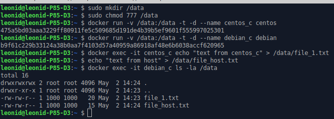

## Задача 1

Сценарий выполнения задачи:

- создайте свой репозиторий на https://hub.docker.com;
- выберете любой образ, который содержит веб-сервер Nginx;
- создайте свой fork образа;
- реализуйте функциональность:
запуск веб-сервера в фоне с индекс-страницей, содержащей HTML-код ниже:
```
<html>
<head>
Hey, Netology
</head>
<body>
<h1>I'm DevOps Engineer!</h1>
</body>
</html>
```
Опубликуйте созданный форк в своем репозитории и предоставьте ответ в виде ссылки на https://hub.docker.com/username_repo.

**Ответ**:

За основу был взят образ nginx:1.21.6. 
Собираем новый образ:
* Создаем файл [index.html](./index.html) 
* Создаем [Dockerfile](./Dockerfile)
* Создаем образ командой ```docker image build -t raleonid/nginx:1.21.6.1 .```
* Запускаем контейнер командой ```docker run -d -p 8080:80 raleonid/nginx:1.21.6.1```
* Проверяем:


* Отправляем образ в удаленный репозиторий 
```commandline
docker login
// авторизуемся
docker image push raleonid/nginx:1.21.6.1
```
[Ссылка на контейнер](https://hub.docker.com/repository/docker/raleonid/nginx)

## Задача 2

Посмотрите на сценарий ниже и ответьте на вопрос:
"Подходит ли в этом сценарии использование Docker контейнеров или лучше подойдет виртуальная машина, физическая машина? Может быть возможны разные варианты?"

Детально опишите и обоснуйте свой выбор.

--

Сценарий:

- Высоконагруженное монолитное java веб-приложение;
- Nodejs веб-приложение;
- Мобильное приложение c версиями для Android и iOS;
- Шина данных на базе Apache Kafka;
- Elasticsearch кластер для реализации логирования продуктивного веб-приложения - три ноды elasticsearch, два logstash и две ноды kibana;
- Мониторинг-стек на базе Prometheus и Grafana;
- MongoDB, как основное хранилище данных для java-приложения;
- Gitlab сервер для реализации CI/CD процессов и приватный (закрытый) Docker Registry.

**Ответ**:
- Высоконагруженное монолитное java веб-приложение. _Не подходит для использования в docker-контейнерах. При высокой утилизации ресурсов, система может вести себя нестабильно, высокое влияние на работу других контейнеров. Согласно [статье, п.1](https://techrocks.ru/2019/11/21/7-cases-when-you-should-not-use-docker/), если ядро обнаружит, что память машины-хоста слишком загружена для выполнения важных системных функций, оно может начать убивать важные процессы. А если будут убиты не те процессы (включая сам Docker), система станет нестабильной. Лучше для этих целей подходят физические сервера, в крайнем случае ВМ с хорошей изоляцией_.
- Nodejs веб-приложение. _Предположу что подойдет для docker-контейнеров. Это веб-приложение, есть готовые образы множество статей как это реализовать_.
- Мобильное приложение c версиями для Android и iOS. _Не подходит. В контейнерах крайне нежелательно использовать приложения с GUI_.
- Шина данных на базе Apache Kafka; _Подходит для использования в Docker-контейнерах. Более того, такое решение отлично кластеризуется docker-compose ([статья](https://dotsandbrackets.com/highly-available-kafka-cluster-docker-ru/)) и работает более стабильно_.
- Elasticsearch кластер для реализации логирования продуктивного веб-приложения - три ноды elasticsearch, два logstash и две ноды kibana; _Предположу что подойдет для docker-контейнеров. В интернете много примеров развертывания ELK в docker, есть готовые Docker-образы_.
- Мониторинг-стек на базе Prometheus и Grafana; _Подходит для использования в Docker-контейнерах. Небольшая нагрузка, OS-Linux, есть готовые Docker-образы_.
- MongoDB, как основное хранилище данных для java-приложения; - _Хотя есть готовые Docker-образы, использование docker для баз данных нежелательно. В контейнере типа stateless БД хранить нельзя, т.к. при его перезапуске все накопленные данные будут утеряны, а использование volume, замедляет(?!) операции чтения/записи_.
- Gitlab сервер для реализации CI/CD процессов и приватный (закрытый) Docker Registry. _Подходит для использования в Docker-контейнерах. В принципе Gitlab можно поставить в виде пакета Omnibus («все в одном»), который уже включает в себя все необходимые компоненты:PostgreSQL, Unicorn, Redis, Nginx, Sidekiq. Но использовав отдельные контейнеры под компоненты системы, более правильно и в будущем позволит относительно легко горизонтально масштабировать компоненты системы_.


## Задача 3

- Запустите первый контейнер из образа ***centos*** c любым тэгом в фоновом режиме, подключив папку ```/data``` из текущей рабочей директории на хостовой машине в ```/data``` контейнера;
- Запустите второй контейнер из образа ***debian*** в фоновом режиме, подключив папку ```/data``` из текущей рабочей директории на хостовой машине в ```/data``` контейнера;
- Подключитесь к первому контейнеру с помощью ```docker exec``` и создайте текстовый файл любого содержания в ```/data```;
- Добавьте еще один файл в папку ```/data``` на хостовой машине;
- Подключитесь во второй контейнер и отобразите листинг и содержание файлов в ```/data``` контейнера.

**Ответ**:
1. Загружаем образы контейнеров:
```commandline
docker pull centos
docker pull debian
```
2. Выполняем задачу:


## Задача 4 (*)

Воспроизвести практическую часть лекции самостоятельно.

Соберите Docker образ с Ansible, загрузите на Docker Hub и пришлите ссылку вместе с остальными ответами к задачам.

**Ответ**: [https://hub.docker.com/repository/docker/raleonid/ansible](https://hub.docker.com/repository/docker/raleonid/ansible)
