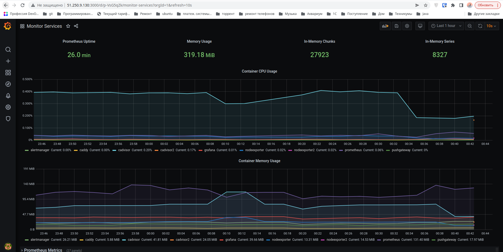

## Задача 1
Создать собственный образ операционной системы с помощью Packer.
Для получения зачета, вам необходимо предоставить скриншот страницы, как на слайде из презентации (слайд 37).

**Ответ**:

## Задача 2
Создать вашу первую виртуальную машину в Яндекс.Облаке.

Для получения зачета, вам необходимо предоставить скриншот страницы свойств созданной ВМ

**Ответ**:

## Задача 3
Создать ваш первый готовый к боевой эксплуатации компонент мониторинга, состоящий из стека микросервисов.
Для получения зачета, вам необходимо предоставить скриншот работающего веб-интерфейса Grafana с текущими метриками.

**Ответ**:

## Задача 4 (*)
Создать вторую ВМ и подключить её к мониторингу развёрнутому на первом сервере.

Для получения зачета, вам необходимо предоставить:

Скриншот из Grafana, на котором будут отображаться метрики добавленного вами сервера.

**Ответ**:
Название сервисов **nodeexporter2** и **cadvisor2**.

Скорректированный terraform и playbook в [папке](../05-virt-04-docker-compose/src)

