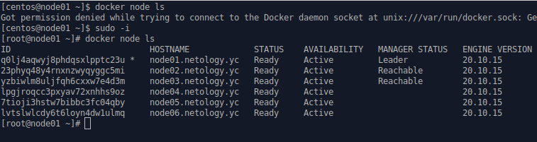
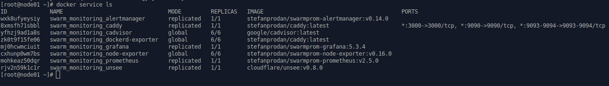
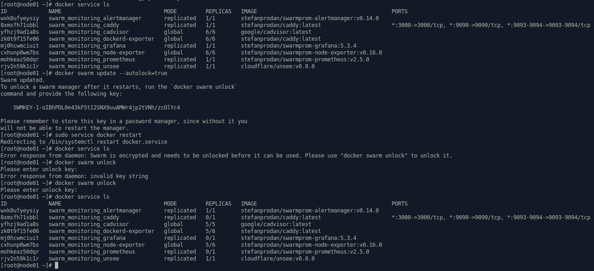

## Задача 1
Дайте письменые ответы на следующие вопросы:
* В чём отличие режимов работы сервисов в Docker Swarm кластере: replication и global?
* Какой алгоритм выбора лидера используется в Docker Swarm кластере?
* Что такое Overlay Network?

**Ответ**:
* В режиме _replication_ мы указываем количество реплик сервиса, которое нужно поднять и система сама решает, на каких нодах их нужно поднять. В режиме _global_ система поднимает реплики на всех нодах.
* Алгоритм поддержания распределенного согласования — Raft. При падении лидера, между управляющими нодами проводится голосование, кто будет следующим лидером. Выигравшая голосование управляющая нода, становится лидером. При возвращении в строй предыдущего лидера он остается управляющей нодой, лидерство ему не переходит. Алгоритм гарантирует что будет выбран лидер и он будет один, а также алгоритм устойчив к разделению кластера. Состояние системы будет фиксироваться, только в том случае, если был получен ответ о получении сообщения от большинства нод.
* Overlay Network - это логическая сеть, которая была создана поверх другой сети (в основном физической).

## Задача 2
Создать ваш первый Docker Swarm кластер в Яндекс.Облаке

Для получения зачета, вам необходимо предоставить скриншот из терминала (консоли), с выводом команды:
```commandline
docker node ls
```

**Ответ**:



## Задача 3
Создать ваш первый, готовый к боевой эксплуатации кластер мониторинга, состоящий из стека микросервисов.

Для получения зачета, вам необходимо предоставить скриншот из терминала (консоли), с выводом команды:
```commandline
docker service ls
```

**Ответ**:



## Задача 4 (*)
Выполнить на лидере Docker Swarm кластера команду (указанную ниже) и дать письменное описание её функционала, что она делает и зачем она нужна:

# см.документацию: https://docs.docker.com/engine/swarm/swarm_manager_locking/
```commandline
docker swarm update --autolock=true
```

**Ответ**:
Данная команда инициирует механизм защиты ключей шифрования: ключа связи между узлами и ключа шифрования журналов Raft в состоянии покоя (Я так понимаю, состояние покоя, это состояние после инициализации нод, но до их активной работы. Поэтому, ввод ключа разблокировки нод требуется после перезагрузки docker, а при добавлении новой ноды - это не нужно).  После выполнения одной из команд:
* docker swarm init --autolock
* docker swarm update --autolock=true

система установит автоблокировку нод (зашифрует ключи), а по результату своей работы, вернёт ключ, с помощью которого их можно будет разблокировать.

