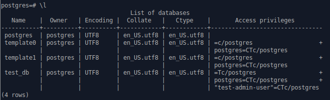

## Задача 1

Используя docker поднимите инстанс PostgreSQL (версию 12) c 2 volume, 
в который будут складываться данные БД и бэкапы.

Приведите получившуюся команду или docker-compose манифест.

### Ответ:
[docker-compose.yaml](src/1/docker-compose.yaml)

## Задача 2

В БД из задачи 1: 
- создайте пользователя test-admin-user и БД test_db
- в БД test_db создайте таблицу orders и clients (спeцификация таблиц ниже)
- предоставьте привилегии на все операции пользователю test-admin-user на таблицы БД test_db
- создайте пользователя test-simple-user  
- предоставьте пользователю test-simple-user права на SELECT/INSERT/UPDATE/DELETE данных таблиц БД test_db

Таблица orders:
- id (serial primary key)
- наименование (string)
- цена (integer)

Таблица clients:
- id (serial primary key)
- фамилия (string)
- страна проживания (string, index)
- заказ (foreign key orders)

Приведите:
- итоговый список БД после выполнения пунктов выше,
- описание таблиц (describe)
- SQL-запрос для выдачи списка пользователей с правами над таблицами test_db
- список пользователей с правами над таблицами test_db

### Ответ:
[docker-compose.yaml](src/2/docker-compose.yaml)
Инициализация БД выполняется в процессе первого выполнения docker-compose up, скриптом из файла [init-test_db.sh](src/2/initdb.d/init-test_db.sh)

#### Итоговый список БД:



#### Описание таблиц (describe)
```commandline
test_db=# \d orders
                                   Table "public.orders"
 Column |         Type          | Collation | Nullable |              Default               
--------+-----------------------+-----------+----------+------------------------------------
 id     | integer               |           | not null | nextval('orders_id_seq'::regclass)
 name   | character varying(20) |           |          | 
 price  | integer               |           |          | 
Indexes:
    "orders_pkey" PRIMARY KEY, btree (id)
Referenced by:
    TABLE "clients" CONSTRAINT "clients_order_id_fkey" FOREIGN KEY (order_id) REFERENCES orders(id)

test_db=# \d clients
                                     Table "public.clients"
  Column  |          Type          | Collation | Nullable |               Default               
----------+------------------------+-----------+----------+-------------------------------------
 id       | integer                |           | not null | nextval('clients_id_seq'::regclass)
 family   | character varying(100) |           |          | 
 country  | character varying(50)  |           |          | 
 order_id | integer                |           |          | 
Indexes:
    "clients_pkey" PRIMARY KEY, btree (id)
    "clients_country_index" btree (country)
Foreign-key constraints:
    "clients_order_id_fkey" FOREIGN KEY (order_id) REFERENCES orders(id)

```

#### SQL-запрос для выдачи списка пользователей с правами над таблицами test_db
```sql
SELECT grantee, table_name, privilege_type 
FROM information_schema.table_privileges 
WHERE table_name in ('clients','orders');
```

#### Список пользователей с правами над таблицами test_db
```commandline
test_db=# SELECT grantee, table_name, privilege_type FROM information_schema.table_privileges WHERE table_name in ('clients','orders');
     grantee      | table_name | privilege_type 
------------------+------------+----------------
 postgres         | orders     | INSERT
 postgres         | orders     | SELECT
 postgres         | orders     | UPDATE
 postgres         | orders     | DELETE
 postgres         | orders     | TRUNCATE
 postgres         | orders     | REFERENCES
 postgres         | orders     | TRIGGER
 test-admin-user  | orders     | INSERT
 test-admin-user  | orders     | SELECT
 test-admin-user  | orders     | UPDATE
 test-admin-user  | orders     | DELETE
 test-admin-user  | orders     | TRUNCATE
 test-admin-user  | orders     | REFERENCES
 test-admin-user  | orders     | TRIGGER
 test-simple-user | orders     | INSERT
 test-simple-user | orders     | SELECT
 test-simple-user | orders     | UPDATE
 test-simple-user | orders     | DELETE
 postgres         | clients    | INSERT
 postgres         | clients    | SELECT
 postgres         | clients    | UPDATE
 postgres         | clients    | DELETE
 postgres         | clients    | TRUNCATE
 postgres         | clients    | REFERENCES
 postgres         | clients    | TRIGGER
 test-admin-user  | clients    | INSERT
 test-admin-user  | clients    | SELECT
 test-admin-user  | clients    | UPDATE
 test-admin-user  | clients    | DELETE
 test-admin-user  | clients    | TRUNCATE
 test-admin-user  | clients    | REFERENCES
 test-admin-user  | clients    | TRIGGER
 test-simple-user | clients    | INSERT
 test-simple-user | clients    | SELECT
 test-simple-user | clients    | UPDATE
 test-simple-user | clients    | DELETE
(36 rows)
```
## Задача 3

Используя SQL синтаксис - наполните таблицы следующими тестовыми данными:

Таблица orders

|Наименование|цена|
|------------|----|
|Шоколад| 10 |
|Принтер| 3000 |
|Книга| 500 |
|Монитор| 7000|
|Гитара| 4000|

Таблица clients

|ФИО|Страна проживания|
|------------|----|
|Иванов Иван Иванович| USA |
|Петров Петр Петрович| Canada |
|Иоганн Себастьян Бах| Japan |
|Ронни Джеймс Дио| Russia|
|Ritchie Blackmore| Russia|

Используя SQL синтаксис:
- вычислите количество записей для каждой таблицы 
- приведите в ответе:
    - запросы 
    - результаты их выполнения.

### Ответ:
[docker-compose.yaml](src/3/docker-compose.yaml)
Инициализация и первоначальное заполнение таблиц БД, выполняется в процессе первого выполнения docker-compose up, скриптом из файла [init-test_db.sh](src/3/initdb.d/init-test_db.sh)

```commandline
test_db=# select count(*) from orders;
 count 
-------
     5
(1 row)

test_db=# select count(*) from clients;
 count 
-------
     5
(1 row)

```

## Задача 4

Часть пользователей из таблицы clients решили оформить заказы из таблицы orders.

Используя foreign keys свяжите записи из таблиц, согласно таблице:

|ФИО|Заказ|
|------------|----|
|Иванов Иван Иванович| Книга |
|Петров Петр Петрович| Монитор |
|Иоганн Себастьян Бах| Гитара |

Приведите SQL-запросы для выполнения данных операций.

Приведите SQL-запрос для выдачи всех пользователей, которые совершили заказ, а также вывод данного запроса.
 
Подсказка - используйте директиву `UPDATE`.

### Ответ:
```SQL
UPDATE clients SET order_id = 3 WHERE id = 1;
UPDATE clients SET order_id = 4 WHERE id = 2;
UPDATE clients SET order_id = 5 WHERE id = 3;

SELECT c.id, c.family, o.name, o.price FROM clients c
JOIN orders o
ON c.order_id = o.id;
```
```commandline
 id |        family        |  name   | price 
----+----------------------+---------+-------
  1 | Иванов Иван Иванович | Книга   |   500
  2 | Петров Петр Петрович | Монитор |  7000
  3 | Иоганн Себастьян Бах | Гитара  |  4000
(3 rows)

```
## Задача 5

Получите полную информацию по выполнению запроса выдачи всех пользователей из задачи 4 
(используя директиву EXPLAIN).

Приведите получившийся результат и объясните что значат полученные значения.

### Ответ:
```commandline
test_db=# EXPLAIN SELECT c.id, c.family, o.name, o.price FROM clients c
test_db-# JOIN orders o
test_db-# ON c.order_id = o.id;
                               QUERY PLAN                               
------------------------------------------------------------------------
 Hash Join  (cost=29.35..42.00 rows=210 width=284)
   Hash Cond: (c.order_id = o.id)
   ->  Seq Scan on clients c  (cost=0.00..12.10 rows=210 width=226)
   ->  Hash  (cost=18.60..18.60 rows=860 width=66)
         ->  Seq Scan on orders o  (cost=0.00..18.60 rows=860 width=66)
(5 rows)
```
Здесь планировщик выбирает соединение по хешу (Hash Join).

В выводе команды EXPLAIN знак -> указывает на иерархию действий (node). Чем раньше выполняется действие, тем с большим отступом оно отображается.

1. Сначала производится построчное чтение таблицы "orders" (Seq Scan):
(cost=0.00..18.60 rows=860 width=66)
* затраты на получение первой строки 0.00
* всех строк 18.60
* приблизительное кол-во возвращаемых строк 860
* средняя длина строки в байтах 66
2. Строки таблицы "orders" записываются в хеш-таблицу в памяти. Затраты: (cost=18.60..18.60 rows=860 width=66)
3. Производится построчное чтение таблицы "clients" (Seq Scan). Затраты: (cost=0.00..12.10 rows=210 width=226).
4. Затем результат чтения таблицы "clients" передаётся узлу Hash Join, который читает строки из узла внешнего потомка и проверяет их по хеш-таблице "orders". Соединение строк выполняется по полям c.order_id = o.id (Hash Cond). Затраты на Hash Join  (cost=29.35..42.00 rows=210 width=284)

Если строк в табл. clients много, то улучшить выполнение запроса можно проиндексировав поле order_id.

## Задача 6

Создайте бэкап БД test_db и поместите его в volume, предназначенный для бэкапов (см. Задачу 1).

Остановите контейнер с PostgreSQL (но не удаляйте volumes).

Поднимите новый пустой контейнер с PostgreSQL.

Восстановите БД test_db в новом контейнере.

Приведите список операций, который вы применяли для бэкапа данных и восстановления. 

### Ответ:
Бэкап можно выполнить 2 командами 
1. pg_dump имя_базы > файл_дампа
2. pg_dumpall > файл_дампа

1-я Команда не копирует пользователей, у которых были права на объекты. И поэтому, при восстановлении бэкапа, все пользователи уже должны быть. Иначе мы получим ошибку "ERROR: role does not exist"

2-я команда копирует все базы со всеми пользователями и правами. Мы будем использовать её.

1. Создайте бэкап БД test_db и поместите его в volume, предназначенный для бэкапов (см. Задачу 1).
```commandline
docker exec -it 3_db_1 bash -c "pg_dumpall -U postgres > /media/postgresql/backup/test_db_$(date '+%Y-%m-%d-%H-%M-%S').sql"
```
2. Остановите контейнер с PostgreSQL (но не удаляйте volumes):
```commandline
docker-compose stop
```
3. Поднимите новый пустой контейнер с PostgreSQL:
```commandline
docker run --rm -d -e POSTGRES_USER=postgres -e POSTGRES_PASSWORD=admin -v ~/PycharmProjects/devops-netology/homeworks/06-db-02-sql/src/3/pgdata1:/var/lib/postgresql/data -v ~/PycharmProjects/devops-netology/homeworks/06-db-02-sql/src/3/backup:/media/postgresql/backup --name psql postgres:12

docker ps
CONTAINER ID   IMAGE         COMMAND                  CREATED         STATUS         PORTS      NAMES
352217ef75dc   postgres:12   "docker-entrypoint.s…"   9 seconds ago   Up 8 seconds   5432/tcp   psql
```

4. Восстановите БД test_db в новом контейнере:
```commandline
docker exec -it psql bash -c "psql -U postgres -f /media/postgresql/backup/test_db_2022-05-25-22-15-58.sql postgres"
```