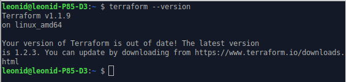
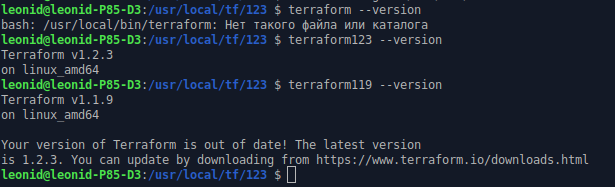

# Домашнее задание к занятию "7.1. Инфраструктура как код"

## Задача 1. Выбор инструментов. 
 
### Легенда
 
Через час совещание на котором менеджер расскажет о новом проекте. Начать работу над которым надо 
будет уже сегодня. 
На данный момент известно, что это будет сервис, который ваша компания будет предоставлять внешним заказчикам.
Первое время, скорее всего, будет один внешний клиент, со временем внешних клиентов станет больше.

Так же по разговорам в компании есть вероятность, что техническое задание еще не четкое, что приведет к большому количеству небольших релизов, тестирований интеграций, откатов, доработок, то есть скучно не будет.  
   
Вам, как девопс инженеру, будет необходимо принять решение об инструментах для организации инфраструктуры.
На данный момент в вашей компании уже используются следующие инструменты: 
- остатки Сloud Formation, 
- некоторые образы сделаны при помощи Packer,
- год назад начали активно использовать Terraform, 
- разработчики привыкли использовать Docker, 
- уже есть большая база Kubernetes конфигураций, 
- для автоматизации процессов используется Teamcity, 
- также есть совсем немного Ansible скриптов, 
- и ряд bash скриптов для упрощения рутинных задач.  

Для этого в рамках совещания надо будет выяснить подробности о проекте, что бы в итоге определиться с инструментами:

1. Какой тип инфраструктуры будем использовать для этого проекта: изменяемый или не изменяемый?
2. Будет ли центральный сервер для управления инфраструктурой?
3. Будут ли агенты на серверах?
4. Будут ли использованы средства для управления конфигурацией или инициализации ресурсов? 
 
В связи с тем, что проект стартует уже сегодня, в рамках совещания надо будет определиться со всеми этими вопросами.

### В результате задачи необходимо

1. Ответить на четыре вопроса представленных в разделе "Легенда". 
2. Какие инструменты из уже используемых вы хотели бы использовать для нового проекта? 
3. Хотите ли рассмотреть возможность внедрения новых инструментов для этого проекта? 

Если для ответа на эти вопросы недостаточно информации, то напишите какие моменты уточните на совещании.

### Ответ:
1.1 Какой тип инфраструктуры будем использовать для этого проекта: изменяемый или не изменяемый?

Неизменяемый. Его преимущества:
* отсутствует проблема дрейфа конфигураций. 
* не будет различий работы функционала в тестовых прогонах и в продуктиве.
* такая инфр-ра подразумевает использование подхода IaS, а значит будет обеспечивать идемпотентность, открытость, автодокументирование изменений. Не будет "тайных" знаний, потеря носителя которых, может осложнить работу компании.
* меньше времени будет уходить на рутинные действия.
* исключается человеческий фактор при развертывании инфр-ры

1.2. Будет ли центральный сервер для управления инфраструктурой?

Непонятно. Требуется уточнить:
 * как физически будет располагаться инфраструктура?
 * какой до неё канал связи?
 * Какая нагрузка предполагается?
 * будет ли возможность (либо требуется) раскатываться на неё (либо обновлять/изменять её конфигурацию) онлайн, либо только в технологические окна, по расписанию?

Последний вопрос самый важный (предыдущие только к нему подводят). Ответ на него по сути и определит, нужен ли центральный сервер или нет. Если изменяем инфру онлайн - то не требуется, если по расписанию - тогда нужен.

P.S. В списке инструментов есть Teamsity и k8s, в которых уже используются центральные сервера.
Для использования Terraform и Ansible они не потребуются.

1.3. Будут ли агенты на серверах?

Зависит от ответа на предыдущий вопрос, и от того, какие инструменты выберем.
Наличие центрального сервера управления инфраструктурой, предполагает использование pull инструментов, для которых, скорее всего, потребуется агент. Без центрального сервера, мы можем использовать push инструменты. Для них агент не нужен.

На нодах Teamsity, будут стоять агенты.
Для использования Terraform и Ansible они не потребуются.

1.4. Будут ли использованы средства для управления конфигурацией или инициализации ресурсов? 

Да. В организации уже активно используются такие инструменты (Packer, Terraform, Docker, k8s, Ansible) и есть ресурсы, которыми без этих инструментов управлять будет тяжело (остатки Сloud Formation), а у сотрудников есть компетенции, логично было бы их задействовать.


2. Какие инструменты из уже используемых вы хотели бы использовать для нового проекта?

* Teamcity для управления pipeline CI/CD
* Ansible - для управления конфигурацией, если инфраструктура будет на VM (сервис "тяжелый", развернуть в контейнерах не представляется возможным).
* Terraform - для инициализации ресурсов, если инфраструктура будет на VM (сервис "тяжелый", развернуть в контейнерах не представляется возможным).
* Docker - для инициализации ресурсов и управления конфигурацией, если планируется разрабатывать легковесный микросервис)
* k8s для оркестрации.

3. Хотите ли рассмотреть возможность внедрения новых инструментов для этого проекта? 

* Teamcity - предложил бы заменить на корпоративный GitLab (если в компании он используется), при условии, что pipeline простые (В некоторых крупных компаниях, корпоративное ПО - это требование и альтернативы GitLab нет). Либо на Jenkins. Он бесплатный, у него больше возможностей и он активно поддерживается сообществом.
* Для простой оркестрации, ели этого достаточно для проекта, предложил бы заменить k8s на Docker swarm.

## Задача 2. Установка терраформ. 

Официальный сайт: https://www.terraform.io/

Установите терраформ при помощи менеджера пакетов используемого в вашей операционной системе.
В виде результата этой задачи приложите вывод команды `terraform --version`.

### Ответ:


## Задача 3. Поддержка легаси кода. 

В какой-то момент вы обновили терраформ до новой версии, например с 0.12 до 0.13. 
А код одного из проектов настолько устарел, что не может работать с версией 0.13. 
В связи с этим необходимо сделать так, чтобы вы могли одновременно использовать последнюю версию терраформа установленную при помощи
штатного менеджера пакетов и устаревшую версию 0.12. 

В виде результата этой задачи приложите вывод `--version` двух версий терраформа доступных на вашем компьютере 
или виртуальной машине.

### Ответ:

```commandline
sudo mkdir -p /usr/local/tf/123
cd /usr/local/tf/123
sudo torsocks wget https://releases.hashicorp.com/terraform/1.2.3/terraform_1.2.3_linux_amd64.zip
sudo unzip terraform_1.2.3_linux_amd64.zip
sudo rm terraform_1.2.3_linux_amd64.zip
sudo mkdir -p /usr/local/tf/119

whereis terraform
    terraform: /usr/local/bin/terraform

sudo mv /usr/local/bin/terraform /usr/local/tf/119/

sudo ln -s /usr/local/tf/123/terraform /usr/bin/terraform123
sudo ln -s /usr/local/tf/119/terraform /usr/bin/terraform119

sudo chmod ugo+x /usr/bin/terraform*
```

