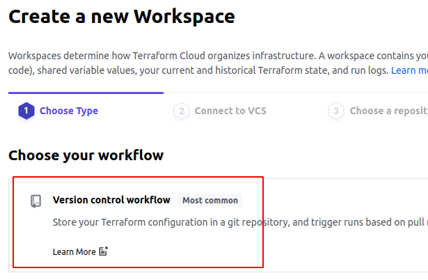
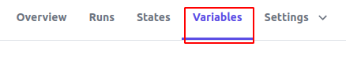
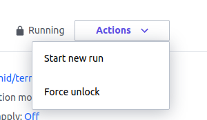
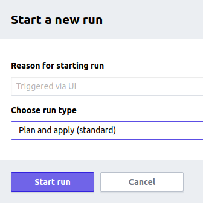
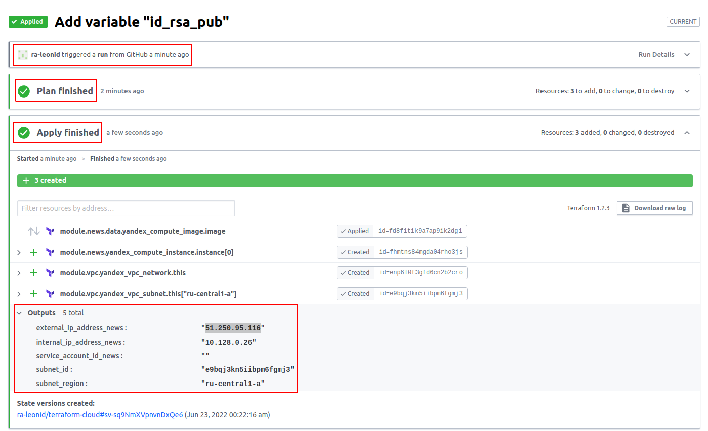
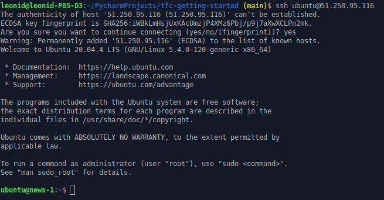
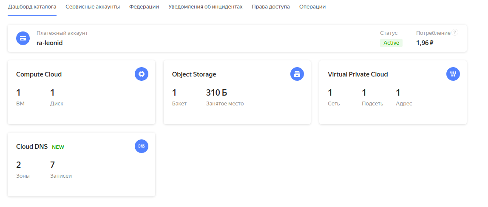
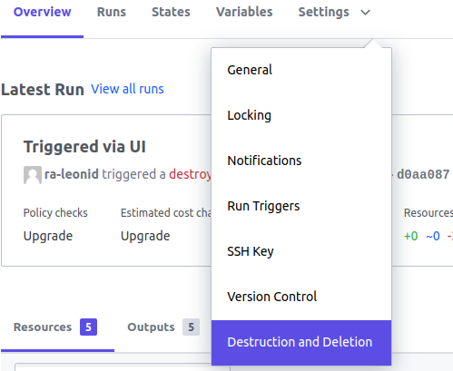

# Домашнее задание к занятию "7.4. Средства командной работы над инфраструктурой."

## Задача 1. Настроить terraform cloud (необязательно, но крайне желательно).

В это задании предлагается познакомиться со средством командой работы над инфраструктурой предоставляемым
разработчиками терраформа. 

1. Зарегистрируйтесь на [https://app.terraform.io/](https://app.terraform.io/).
(регистрация бесплатная и не требует использования платежных инструментов).
1. Создайте в своем github аккаунте (или другом хранилище репозиториев) отдельный репозиторий с
 конфигурационными файлами прошлых занятий (или воспользуйтесь любым простым конфигом).
1. Зарегистрируйте этот репозиторий в [https://app.terraform.io/](https://app.terraform.io/).
1. Выполните plan и apply. 

В качестве результата задания приложите снимок экрана с успешным применением конфигурации.

## Ответ:
**У меня получилось настроить использование Terraform Cloud, GitHub и Yandex Cloud**

Порядок действий:
1. Поднимаем VPN
2. При регистрации на [https://app.terraform.io/](https://app.terraform.io/), указываем почту *@gmail.com.
3. Создаём отдельный [репозиторий](https://github.com/ra-leonid/terraform-cloud), переносим в него проект с предыдущего урока.

   Особенности:
* Файлы `tf` должны лежать в корне, иначе Terraform Cloud их не увидит.
* В секцию `terraform` добавляем код бэкэнда terraform cloud
```commandline
  backend "remote" {
    hostname = "app.terraform.io"
    organization = "ra-leonid"

    workspaces {
      name = "terraform-cloud"
      #prefix = "my-app-"
    }
  }

  required_version = ">= 0.14.0"
```

В дальнейшем, по значениям из `organization` и `terraform-cloud`, выполним настройку рабочего пространства в `app.terraform.io`.

* В `resource "yandex_compute_instance" "instance"`, в `ssh-keys`, меняем использование файла на переменную в неё мы будем передавать открытый ключ.
4. В terraform cloud создаём `organization`, а в ней `workspace`. **Имена как в backend "remote"!!!** При создании workspace, выбираем `Version control folder`.


5. Далее выбираем репозиторий, авторизуемся (тут всё просто).
6. После авторизации, подтянется проект и попробует собраться, упадёт с ошибкой. Ничего страшного, нужно заполнить переменные и ключи.
7. Переходим на закладку `Variables`


8. Добавляем переменные, тип выбираем `terraform`. имена должны быть как в файле `vars.tf`.
9. Для переменной `id_rsa_pub` значение берём из файла `~/.ssh/id_rsa.pub`.

Выполняем сборку





Если мы проделали всё правильно, то получаем вот такую картину!







Для выполнения `destroy`, необходимо выбрать пункт меню `Destruction and Deletion`.



### Из минусов: 
Ещё не разобрался как использовать различные workspace. Пока, в местах, где используется `terraform.workspace` захаркодил на `local.workspace`. Надо будет ещё покопаться.

## Задача 2. Написать серверный конфиг для атлантиса. 

Смысл задания – познакомиться с документацией 
о [серверной](https://www.runatlantis.io/docs/server-side-repo-config.html) конфигурации и конфигурации уровня 
 [репозитория](https://www.runatlantis.io/docs/repo-level-atlantis-yaml.html).

Создай `server.yaml` который скажет атлантису:
1. Укажите, что атлантис должен работать только для репозиториев в вашем github (или любом другом) аккаунте.
1. На стороне клиентского конфига разрешите изменять `workflow`, то есть для каждого репозитория можно 
будет указать свои дополнительные команды. 
1. В `workflow` используемом по-умолчанию сделайте так, что бы во время планирования не происходил `lock` состояния.

Создай `atlantis.yaml` который, если поместить в корень terraform проекта, скажет атлантису:
1. Надо запускать планирование и аплай для двух воркспейсов `stage` и `prod`.
1. Необходимо включить автопланирование при изменении любых файлов `*.tf`.

В качестве результата приложите ссылку на файлы `server.yaml` и `atlantis.yaml`.

### Ответ:
[server.yaml](./server.yaml)

[atlantis.yaml](./atlantis.yaml)

## Задача 3. Знакомство с каталогом модулей. 

1. В [каталоге модулей](https://registry.terraform.io/browse/modules) найдите официальный модуль от aws для создания
`ec2` инстансов. 
2. Изучите как устроен модуль. Задумайтесь, будете ли в своем проекте использовать этот модуль или непосредственно 
ресурс `aws_instance` без помощи модуля?
3. В рамках предпоследнего задания, был создан ec2 при помощи ресурса `aws_instance`. 
Создайте аналогичный инстанс при помощи найденного модуля.   

В качестве результата задания приложите ссылку на созданный блок конфигураций. 

### Ответ:
[main.tf](./main.tf)

