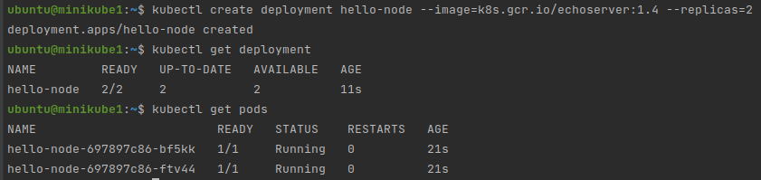
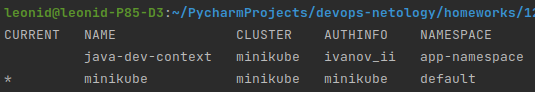
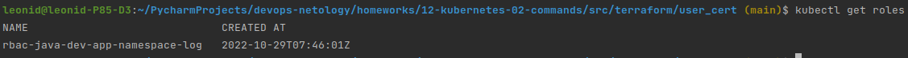
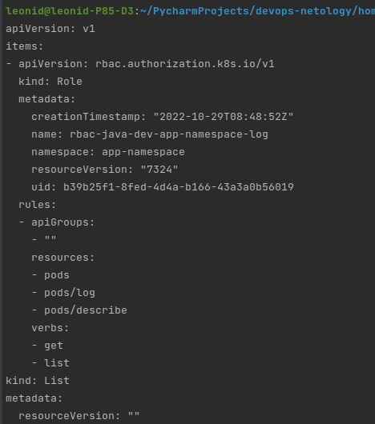
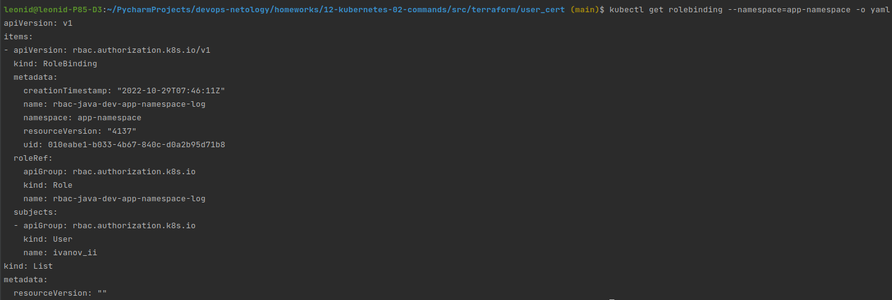
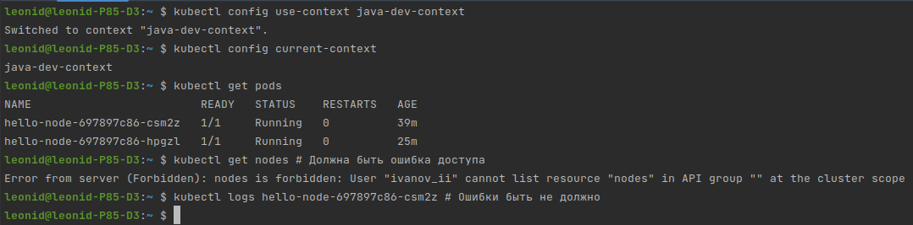
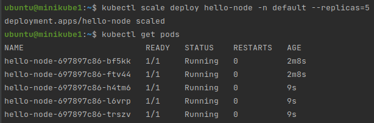

# Домашнее задание к занятию "12.2 Команды для работы с Kubernetes"
Кластер — это сложная система, с которой крайне редко работает один человек. Квалифицированный devops умеет наладить работу всей команды, занимающейся каким-либо сервисом.
После знакомства с кластером вас попросили выдать доступ нескольким разработчикам. Помимо этого требуется служебный аккаунт для просмотра логов.

## Задание 1: Запуск пода из образа в деплойменте
Для начала следует разобраться с прямым запуском приложений из консоли. Такой подход поможет быстро развернуть инструменты отладки в кластере. Требуется запустить деплоймент на основе образа из hello world уже через deployment. Сразу стоит запустить 2 копии приложения (replicas=2). 

Требования:
 * пример из hello world запущен в качестве deployment
 * количество реплик в deployment установлено в 2
 * наличие deployment можно проверить командой kubectl get deployment
 * наличие подов можно проверить командой kubectl get pods

### Решение:
Увеличиваем количество реплик при создании deployment:
```commandline
kubectl create deployment hello-node --image=k8s.gcr.io/echoserver:1.4 --replicas=2
```




## Задание 2: Просмотр логов для разработки
Разработчикам крайне важно получать обратную связь от штатно работающего приложения и, еще важнее, об ошибках в его работе. 
Требуется создать пользователя и выдать ему доступ на чтение конфигурации и логов подов в app-namespace.

Требования: 
 * создан новый токен доступа для пользователя
 * пользователь прописан в локальный конфиг (~/.kube/config, блок users)
 * пользователь может просматривать логи подов и их конфигурацию (kubectl logs pod <pod_id>, kubectl describe pod <pod_id>)

### Решение:
1. На control-node создаем сертификат пользователя:
```commandline
mkdir user_cert && cd user_cert
openssl genrsa -out ivanov_ii.key 2048
openssl req -new -key ivanov_ii.key -out ivanov_ii.csr -subj "/CN=ivanov_ii/O=java-dev"
openssl x509 -req -in ivanov_ii.csr -CA ~/.minikube/ca.crt -CAkey ~/.minikube/ca.key -CAcreateserial -out ivanov_ii.crt -days 500
```
2. Создаем и добавляем пользователя в kubeconfig:
```commandline
kubectl config set-credentials ivanov_ii --client-certificate=ivanov_ii.crt --client-key=ivanov_ii.key
```
3. Создаем новый `namespace`
```commandline
kubectl create namespace app-namespace
```
4. Создаем и добавляем контекст пользователя в kubeconfig:
```commandline
kubectl config set-context java-dev-context --cluster=minikube --user=ivanov_ii --namespace=app-namespace
```
5. Создаем роль и связываем её с помощью rolebinding, с пользователем и пространством имен.
Вариант с применением манифестов `role`, `rolebinding` был описан в указанных ссылках, поэтому повторять это было неинтересно.
Я попробовал сделать через команды
```commandline
kubectl create role rbac-java-dev-app-namespace-log --verb=get,list --resource=pods,pods/log,pods/describe --namespace=app-namespace
kubectl create rolebinding rbac-java-dev-app-namespace-log --role=rbac-java-dev-app-namespace-log --user=ivanov_ii --namespace=app-namespace
```
6. Проверяем что получилось:
```commandline
kubectl config get-contexts
kubectl get roles
kubectl get roles -o yaml
kubectl get rolebinding --namespace=app-namespace -o yaml
```









7. Тестируем права пользователя:
```commandline
kubectl config use-context java-dev-context
kubectl config current-context
kubectl get pods
kubectl get nodes # Должна быть ошибка доступа
kubectl logs hello-node-697897c86-csm2z # Ошибки быть не должно
```




## Задание 3: Изменение количества реплик 
Поработав с приложением, вы получили запрос на увеличение количества реплик приложения для нагрузки. Необходимо изменить запущенный deployment, увеличив количество реплик до 5. Посмотрите статус запущенных подов после увеличения реплик. 

Требования:
 * в deployment из задания 1 изменено количество реплик на 5
 * проверить что все поды перешли в статус running (kubectl get pods)

### Решение:
Увеличить количество реплик запущенном deployment можно несколькими способами:
1. Командой:
```commandline
kubectl scale deploy hello-node -n default --replicas=5
```
2. Редактированием config. Находим параметр `replicas` и меняем на нужное значение. 
```commandline
kubectl edit deployment hello-node
```



---

### Как оформить ДЗ?

Выполненное домашнее задание пришлите ссылкой на .md-файл в вашем репозитории.

---