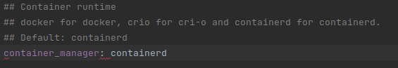
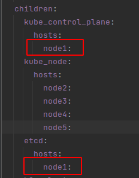
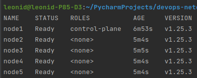

# Домашнее задание к занятию "12.4 Развертывание кластера на собственных серверах, лекция 2"
Новые проекты пошли стабильным потоком. Каждый проект требует себе несколько кластеров: под тесты и продуктив. Делать все руками — не вариант, поэтому стоит автоматизировать подготовку новых кластеров.

## Задание 1: Подготовить инвентарь kubespray
Новые тестовые кластеры требуют типичных простых настроек. Нужно подготовить инвентарь и проверить его работу. Требования к инвентарю:
* подготовка работы кластера из 5 нод: 1 мастер и 4 рабочие ноды;
* в качестве CRI — containerd;
* запуск etcd производить на мастере.

## Задание 2 (*): подготовить и проверить инвентарь для кластера в AWS
Часть новых проектов хотят запускать на мощностях AWS. Требования похожи:
* разворачивать 5 нод: 1 мастер и 4 рабочие ноды;
* работать должны на минимально допустимых EC2 — t3.small.

### Решение:
Запуск сборки кластера осуществляется командой `terraform apply -auto-approve` из каталога `./terraform`. Terraform собирает динамический инвентарь и сохраняет его в `./kubespray/inventory/mycluster/hosts.yaml`. Код сборки инвентаря в `./terraform/inventory.tf`, шаблон - `./terraform/templates/hosts.tpl`. Также собирается динамический инвентарь для выполнения на локальной машине, который сохраняется по пути `./ansible/inventory.yml`.

После создания инфраструктуры кластера, автоматически стартует kuberspray (код запуска в `./terraform/kuberspray.tf`).
Переменная `supplementary_addresses_in_ssl_keys` задается в параметрах запуска ansible, так что её перед запуском также не нужно устанавливать.

После kuberspray стартует `./terraform/local_config.tf`, который копирует и настраивает `.kube/config` на локальной машине. Т.о., после выполнения скрипта, можно сразу приступать к работе с ним на локальной машине.

Количество инстансов control_plane и node задается параметрами `control_plane_instance_count` и `slave_node_instance_count` в файле `./terraform/variables.tf` соответственно.

* CRI — containerd по умолчанию

* etcd запущена на control_plane

* Количество нод 5, из них 1 control_plane

---

### Как оформить ДЗ?

Выполненное домашнее задание пришлите ссылкой на .md-файл в вашем репозитории.

---