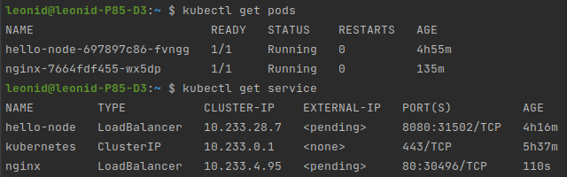

# Домашнее задание к занятию "12.5 Сетевые решения CNI"
После работы с Flannel появилась необходимость обеспечить безопасность для приложения. Для этого лучше всего подойдет Calico.
## Задание 1: установить в кластер CNI плагин Calico
Для проверки других сетевых решений стоит поставить отличный от Flannel плагин — например, Calico. Требования: 
* установка производится через ansible/kubespray;
* после применения следует настроить политику доступа к hello-world извне. Инструкции [kubernetes.io](https://kubernetes.io/docs/concepts/services-networking/network-policies/), [Calico](https://docs.projectcalico.org/about/about-network-policy)

### Решение:
1. Поднимаем деплой тестового приложения:</br>
```commandline
kubectl create deployment hello-node --image=k8s.gcr.io/echoserver:1.4
kubectl expose deployment hello-node --type=LoadBalancer --port=8080
```
2. Поднимаем деплой любого приложения, с которого будем тестировать доступ:</br>
```commandline
kubectl apply -f ../manifests/deploy/nginx.yml
kubectl expose deployment nginx --type=LoadBalancer --port=80
```
</br>
3. Проверяем, что доступы есть:</br>
```commandline
kubectl -n default exec nginx-7664fdf455-wx5dp -- curl -s hello-node:8080
```
</br>
```commandline
kubectl -n default exec hello-node-697897c86-fvngg -- curl -s nginx:80
```
</br>
4. Запрещаем входящий и исходящий траффик пода hello-node:</br>
```commandline
kubectl apply -f ../manifests/network-policy/all-deny.yml
```
5. Проверяем доступ:</br>
```commandline
kubectl -n default exec nginx-7664fdf455-wx5dp -- curl -s -m 1 hello-node:8080
kubectl -n default exec hello-node-697897c86-fvngg -- curl -s -m 1 nginx:80
```
</br>
6. Разрешаем входящий траффик к hello-node от nginx:</br>
```commandline
kubectl apply -f ../manifests/network-policy/ingress-hello-node.yml 
```
7. Проверяем доступ:</br>
```commandline
kubectl -n default exec nginx-7664fdf455-wx5dp -- curl -s -m 1 hello-node:8080
kubectl -n default exec hello-node-697897c86-fvngg -- curl -s -m 1 nginx:80
```


## Задание 2: изучить, что запущено по умолчанию
Самый простой способ — проверить командой calicoctl get <type>. Для проверки стоит получить список нод, ipPool и profile.
Требования: 
* установить утилиту calicoctl;
* получить 3 вышеописанных типа в консоли.

### Решение:
1.Установка calicoctl:</br>
```commandline
# Ставим на control-node и локальном ПК 
sudo curl -L https://github.com/projectcalico/calico/releases/download/v3.23.3/calicoctl-linux-amd64 -o /usr/local/bin/calicoctl
sudo chmod +x /usr/local/bin/calicoctl
```


### Как оформить ДЗ?

Выполненное домашнее задание пришлите ссылкой на .md-файл в вашем репозитории.