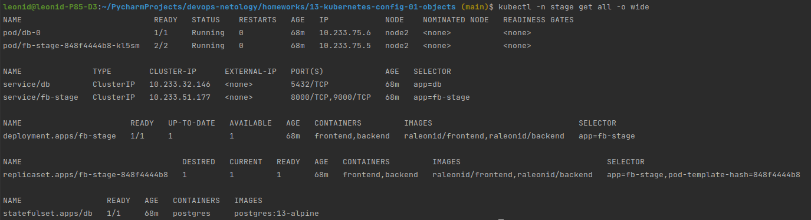
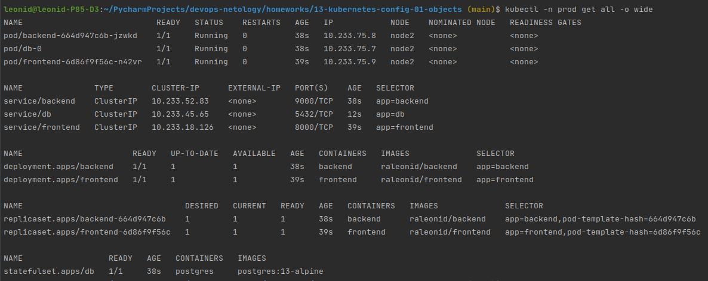

# Домашнее задание к занятию "13.1 контейнеры, поды, deployment, statefulset, services, endpoints"
Настроив кластер, подготовьте приложение к запуску в нём. Приложение стандартное: бекенд, фронтенд, база данных. Его можно найти в папке 13-kubernetes-config.

## Задание 1: подготовить тестовый конфиг для запуска приложения
Для начала следует подготовить запуск приложения в stage окружении с простыми настройками. Требования:
* под содержит в себе 2 контейнера — фронтенд, бекенд;
* регулируется с помощью deployment фронтенд и бекенд;
* база данных — через statefulset.

## Ответ:
1. Копируем папку [13-kubernetes-config](https://github.com/zaglodin/13-kubernetes-config-01-objects/tree/master/13-kubernetes-config).
2. Из файла [.env.example](./13-kubernetes-config/backend/.env.example) создаем файл [.env](./13-kubernetes-config/backend/.env).
3. Авторизуемся на dockerhub `docker login`
4. Собираем докер-образы и отправляем их в dockerhub.
   1. Собираем образ. В каталоге [backend](./13-kubernetes-config/backend) выполняем команду:
   ```docker image build -t raleonid/backend .```
   2. Отправляем образ в удаленный репо:
   ```commandline
   docker image push raleonid/backend
   ```
5. Повторяем операцию для frontend.
   1. Собираем образ. В каталоге [backend](./13-kubernetes-config/backend) выполняем команду:
   ```docker image build -t raleonid/frontend .```
      1. На этапе сборки образа ловим ошибку:
      ```text
        cross-env NODE_ENV=production webpack --config webpack.config.js --mode production

        ℹ Compiling Production build progress
        Error: error:0308010C:digital envelope routines::unsupported
        ...
       ```
      2. Фиксим ошибку добавив в [Dockerfile](./13-kubernetes-config/frontend) строки: 
      ```dockerfile
      ENV NODE_OPTIONS="--openssl-legacy-provider"
      RUN npx browserslist@latest --update-db
      ```
   2. Отправляем образ в удаленный репо:
   ```commandline
   docker image push raleonid/frontend
   ```
6. Создаем новый `namespace`
   ```commandline
   kubectl create namespace stage
   ```
7. Деплоим приложение:
   ```commandline
   kubectl apply -f ./manifests/stage.yml
   ```
8. Результат:
   ```commandline
   kubectl -n stage get all -o wide
   ```
   
      


## Задание 2: подготовить конфиг для production окружения
Следующим шагом будет запуск приложения в production окружении. Требования сложнее:
* каждый компонент (база, бекенд, фронтенд) запускаются в своем поде, регулируются отдельными deployment’ами;
* для связи используются service (у каждого компонента свой);
* в окружении фронта прописан адрес сервиса бекенда;
* в окружении бекенда прописан адрес сервиса базы данных.

## Ответ:
Предварительно устанавливаем nfs-server-provisioner:
```commandline
$ helm repo add nfs-ganesha-server-and-external-provisioner https://kubernetes-sigs.github.io/nfs-ganesha-server-and-external-provisioner/
$ helm install my-release nfs-ganesha-server-and-external-provisioner/nfs-server-provisioner
```
---
1. Создаем новый `namespace`
   ```commandline
   kubectl create namespace prod
   ```
2. Деплоим PersistentVolume, PersistentVolumeClaim
   ```commandline
   kubectl apply -f ./manifests/pv-10mi-nfc.yml
   kubectl apply -f ./manifests/pvc.yml
   ```

3. Деплоим приложение:
   ```commandline
   kubectl apply -f ./manifests/prod.yml
   ```
4. Результат:
   ```commandline
   kubectl -n prod get all -o wide
   ```
   
      


## Задание 3 (*): добавить endpoint на внешний ресурс api
Приложению потребовалось внешнее api, и для его использования лучше добавить endpoint в кластер, направленный на это api. Требования:
* добавлен endpoint до внешнего api (например, геокодер).

---

### Как оформить ДЗ?

Выполненное домашнее задание пришлите ссылкой на .md-файл в вашем репозитории.

В качестве решения прикрепите к ДЗ конфиг файлы для деплоя. Прикрепите скриншоты вывода команды kubectl со списком запущенных объектов каждого типа (pods, deployments, statefulset, service) или скриншот из самого Kubernetes, что сервисы подняты и работают.

---
