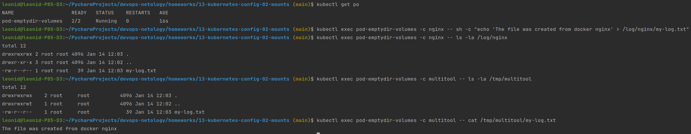
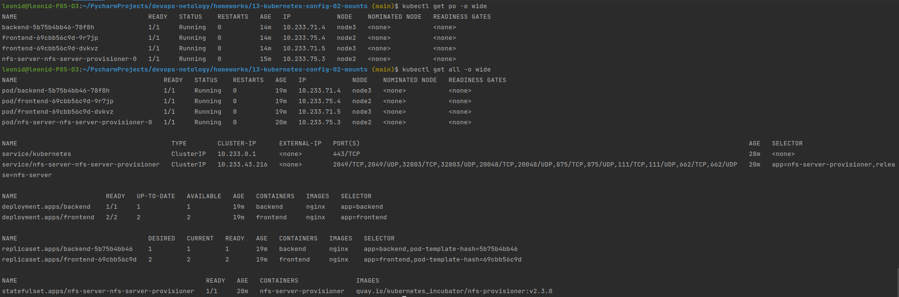
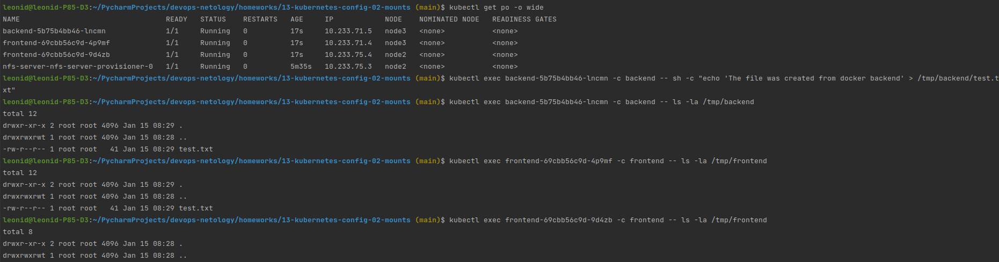

# Домашнее задание к занятию "13.2 разделы и монтирование"
Приложение запущено и работает, но время от времени появляется необходимость передавать между бекендами данные. А сам бекенд генерирует статику для фронта. Нужно оптимизировать это.
Для настройки NFS сервера можно воспользоваться следующей инструкцией (производить под пользователем на сервере, у которого есть доступ до kubectl):
* установить helm: curl https://raw.githubusercontent.com/helm/helm/master/scripts/get-helm-3 | bash
* добавить репозиторий чартов: helm repo add stable https://charts.helm.sh/stable && helm repo update
* установить nfs-server через helm: helm install nfs-server stable/nfs-server-provisioner

В конце установки будет выдан пример создания PVC для этого сервера.

## Задание 1: подключить для тестового конфига общую папку
В stage окружении часто возникает необходимость отдавать статику бекенда сразу фронтом. Проще всего сделать это через общую папку. Требования:
* в поде подключена общая папка между контейнерами (например, /static);
* после записи чего-либо в контейнере с беком файлы можно получить из контейнера с фронтом.

### Ответ:
1. Публикуем под с 2 контейнерами и общей папкой
```commandline
kubectl apply -f ./manifests/stage.yml
```
2. Создаем файлы в разных контейнерах и проверяем их наличие в другом контейнере
```commandline
kubectl exec pod-emptydir-volumes -c nginx -- sh -c "echo 'The file was created from docker nginx' > /log/nginx/my-log.txt"
kubectl exec pod-emptydir-volumes -c nginx -- ls -la /log/nginx
kubectl exec pod-emptydir-volumes -c multitool -- ls -la /tmp/multitool
```
3. Проверяем что папка `test-volume` является общей для обоих контейнеров:



## Задание 2: подключить общую папку для прода
Поработав на stage, доработки нужно отправить на прод. В продуктиве у нас контейнеры крутятся в разных подах, поэтому потребуется PV и связь через PVC. Сам PV должен быть связан с NFS сервером. Требования:
* все бекенды подключаются к одному PV в режиме ReadWriteMany;
* фронтенды тоже подключаются к этому же PV с таким же режимом;
* файлы, созданные бекендом, должны быть доступны фронту.

### Ответ:
1. Разворачиваем PersistentVolume:
   ```commandline
   kubectl apply -f ./manifests/prod/pv-10mi-nfc.yml
   ```
2. Разворачиваем PersistentVolumeClaim:
   ```commandline
   kubectl apply -f ./manifests/prod/pvc.yml
   ```
3. Публикуем приложение
   ```commandline
   kubectl apply -f ./manifests/prod/prod.yml
   ```
4. Результат, всё успешно запущено:

   
5. Создаем файлы в разных контейнерах и проверяем их наличие в других контейнерах:
```commandline
kubectl exec backend-5b75b4bb46-dpbvj -c backend -- sh -c "echo 'The file was created from docker backend' > /tmp/backend/test.txt"
kubectl exec backend-5b75b4bb46-dpbvj -c backend -- ls -la /tmp/backend
kubectl exec frontend-69cbb56c9d-bnztt -c frontend -- ls -la /tmp/frontend
kubectl exec frontend-69cbb56c9d-dnjcf -c frontend -- ls -la /tmp/frontend
```
3. Проверяем что nfc папка является общей для обоих контейнеров:
   ... и видим что папка доступна только в подах расположенных на одной ноде. К node3 папка примонтировалась, а к node2 - нет. Хотя режим доступа ReadWriteMany. 
   Почему?



---

### Как оформить ДЗ?

Выполненное домашнее задание пришлите ссылкой на .md-файл в вашем репозитории.

---