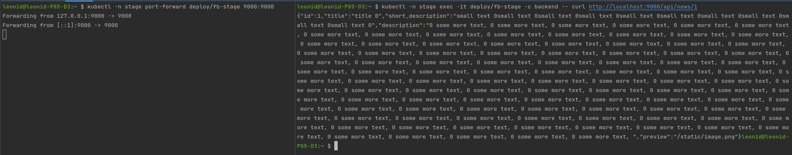

# Домашнее задание к занятию "13.3 работа с kubectl"
## Задание 1: проверить работоспособность каждого компонента
Для проверки работы можно использовать 2 способа: port-forward и exec. Используя оба способа, проверьте каждый компонент:
* сделайте запросы к бекенду;
* сделайте запросы к фронту;
* подключитесь к базе данных.

### Ответ:
В ходе проверки, были выявлены и исправлены ошибки задания 13-kubernetes-config-01-objects.

1. Проверяем frontend посредством port-forward:
```commandline
kubectl -n stage port-forward deploy/fb-stage 8080:80
curl 127.0.0.1:8080

kubectl -n prod port-forward svc/frontend 8080:8000
curl 127.0.0.1:8080
```


2. Проверяем frontend изнутри контейнера:
```commandline
kubectl -n stage exec -it deploy/fb-stage -c frontend -- curl 127.0.0.1
kubectl -n prod exec -it deploy/frontend -c frontend -- curl 127.0.0.1
```


3. Проверяем backend посредством port-forward:
```commandline
kubectl -n stage port-forward deploy/fb-stage 9000:9000
curl http://localhost:9000/api/news/1
```


4. Проверяем backend изнутри контейнера:
```commandline
kubectl -n stage exec -it deploy/fb-stage -c backend -- curl http://localhost:9000/api/news/1
kubectl -n prod exec -it deploy/backend -c backend -- curl http://backend:9000/api/news/1
```


5. Проверяем db посредством port-forward:
```commandline
kubectl -n stage port-forward service/db 5432:5432
psql -h 127.0.0.1 -p 5432 -U postgres -W -c "\l"
```


6. Проверяем db изнутри контейнера:
```commandline
kubectl -n stage exec -it db-0 -c postgres -- psql -U postgres -W -c "\l"
kubectl -n prod exec -it db-0 -c postgres -- psql -U postgres -W -c "\l"
```


## Задание 2: ручное масштабирование

При работе с приложением иногда может потребоваться вручную добавить пару копий. Используя команду kubectl scale, попробуйте увеличить количество бекенда и фронта до 3. Проверьте, на каких нодах оказались копии после каждого действия (kubectl describe, kubectl get pods -o wide). После уменьшите количество копий до 1.

### Ответ:
В namespace prod увеличиваем количество реплик бэкэнда и фронта до 3. Выполним одной командой сразу на обоих деплоях:
```commandline
kubectl -n prod scale --replicas=3 deploy -l 'app in (backend, frontend)'
```

Команды для проверки:
```commandline
kubectl -n prod get po -l 'app in (backend, frontend)'
kubectl -n prod get deploy -l 'app in (backend, frontend)'
```

Поды были на обоих нодах. После репликации они также равномерно распределились по всем нодам.


Уменьшаем количество реплик до 1:
```commandline
kubectl -n prod scale --replicas=1 deploy -l 'app in (backend, frontend)'
```


---
### Как оформить ДЗ?

Выполненное домашнее задание пришлите ссылкой на .md-файл в вашем репозитории.

---