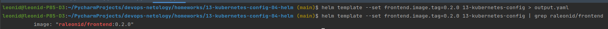

# Домашнее задание к занятию "13.4 инструменты для упрощения написания конфигурационных файлов. Helm и Jsonnet"
В работе часто приходится применять системы автоматической генерации конфигураций. Для изучения нюансов использования разных инструментов нужно попробовать упаковать приложение каждым из них.

## Задание 1: подготовить helm чарт для приложения
Необходимо упаковать приложение в чарт для деплоя в разные окружения. Требования:
* каждый компонент приложения деплоится отдельным deployment’ом/statefulset’ом;
* в переменных чарта измените образ приложения для изменения версии.

### Ответ:
[](13-kubernetes-config)

При сборке чарта командой:
```commandline
helm template --set frontend.image.tag=0.2.0 13-kubernetes-config > output.yaml
```
получаем на выходе манифест [output.yaml](output.yaml)




## Задание 2: запустить 2 версии в разных неймспейсах
Подготовив чарт, необходимо его проверить. Попробуйте запустить несколько копий приложения:
* одну версию в namespace=app1;
* вторую версию в том же неймспейсе;
* третью версию в namespace=app2.

### Ответ:
#### Одну версию в namespace=app1:
```commandline
helm install --create-namespace -n app1 demo-release 13-kubernetes-config
helm list -n app1
```


#### Вторую версию в том же неймспейсе:
Меняем `appVersion` в `Chart.yaml` на 0.1.1

```commandline
helm install --create-namespace -n app1 demo-release 13-kubernetes-config
helm list -n app1
```
Мы видим, что установить в тот-же неймспейс не удасться, а вот обновить - можно. При это у обновленного приложения меняется ревизия и версия.


#### Третью версию в namespace=app2.
Меняем `appVersion` в `Chart.yaml` на 0.1.2

```commandline
helm install --create-namespace -n app2 demo-release 13-kubernetes-config
helm list -n app2
```
И...

Получаем ошибку :-(


Но, проблема связана с выделением томов. Скорректируем наш чарт, чтобы для каждого namespace создавался свой PersistentVolume.

В файле `pv-10mi-nfc.yml` шаблонизируем имя метаданных:
```commandline
metadata:
  name: pv-10mi-nfc-{{ .Release.Namespace}}
```

Устанавливаем повторно - всё успешно!


## Задание 3 (*): повторить упаковку на jsonnet
Для изучения другого инструмента стоит попробовать повторить опыт упаковки из задания 1, только теперь с помощью инструмента jsonnet.

---

### Как оформить ДЗ?

Выполненное домашнее задание пришлите ссылкой на .md-файл в вашем репозитории.

---