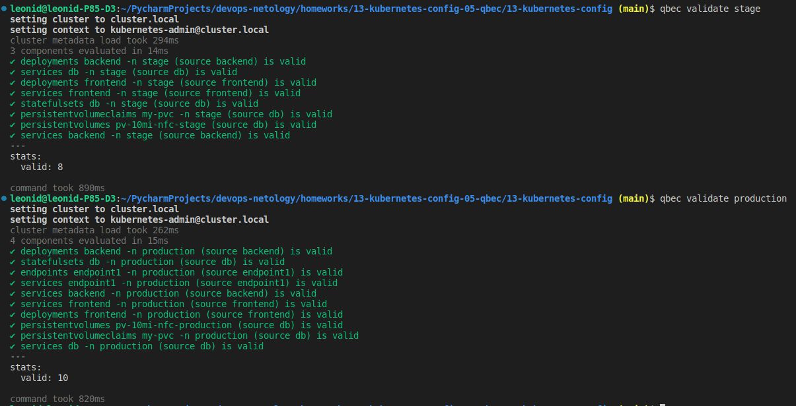
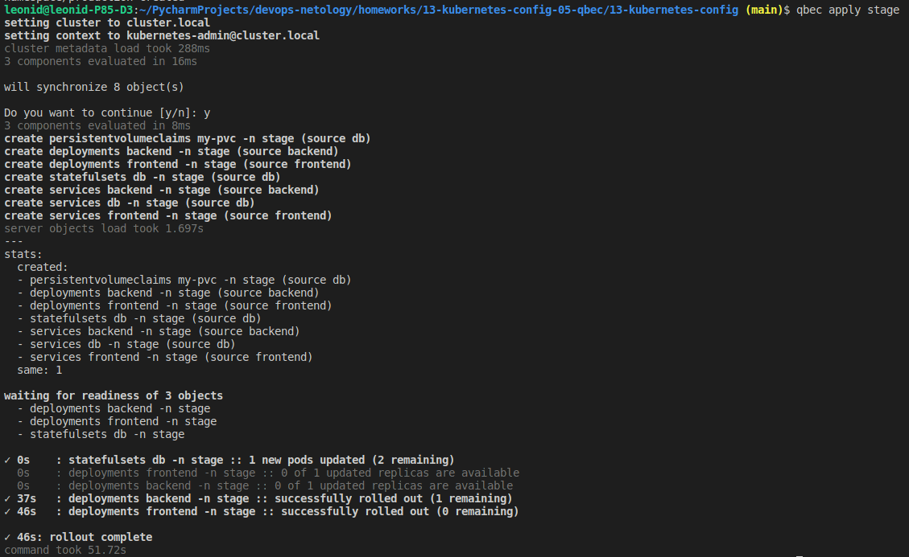
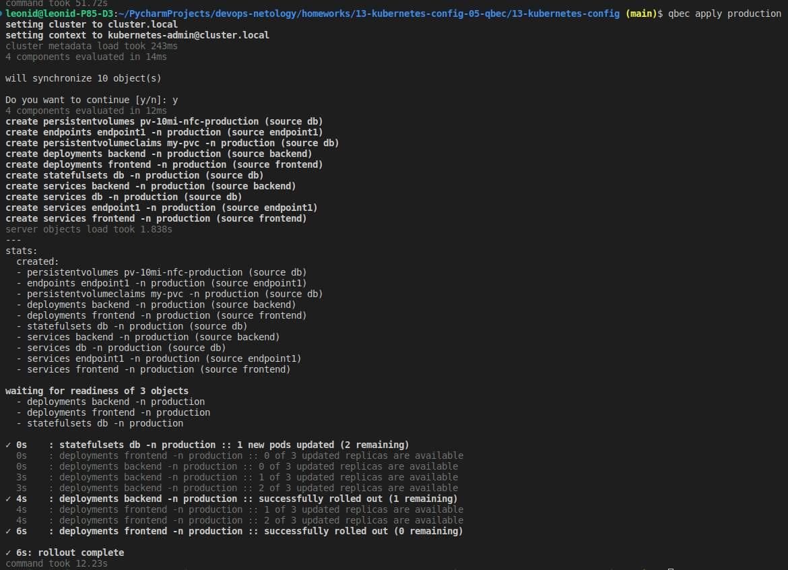
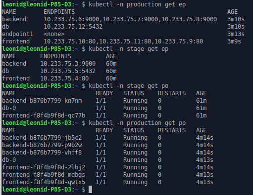

# Домашнее задание к занятию "13.5 поддержка нескольких окружений на примере Qbec"
Приложение обычно существует в нескольких окружениях. Для удобства работы следует использовать соответствующие инструменты, например, Qbec.

## Задание 1: подготовить приложение для работы через qbec
Приложение следует упаковать в qbec. Окружения должно быть 2: stage и production. 

Требования:
* stage окружение должно поднимать каждый компонент приложения в одном экземпляре;
* production окружение — каждый компонент в трёх экземплярах;
* для production окружения нужно добавить endpoint на внешний адрес.

### Ответ

1. Результат валидации:

2. Результат установки stage:

3. Результат установки production:

4. Компоненты:

---

### Как оформить ДЗ?

Выполненное домашнее задание пришлите ссылкой на .md-файл в вашем репозитории.

---