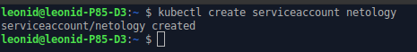
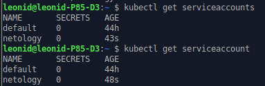
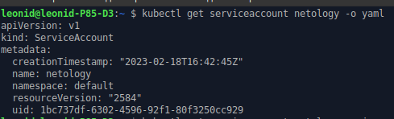
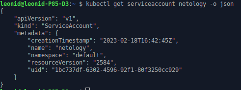
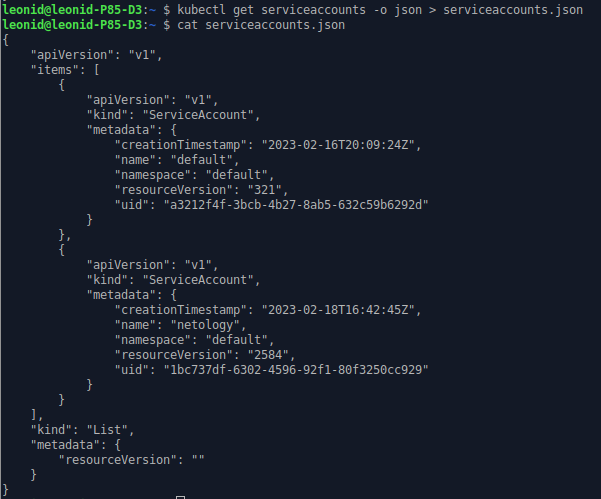
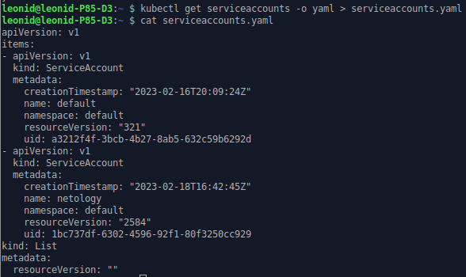
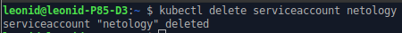
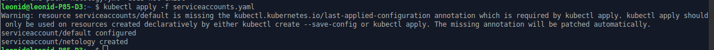

# Домашнее задание к занятию "14.4 Сервис-аккаунты"

## Задача 1: Работа с сервис-аккаунтами через утилиту kubectl в установленном minikube

Выполните приведённые команды в консоли. Получите вывод команд. Сохраните
задачу 1 как справочный материал.

### Как создать сервис-аккаунт?

```
kubectl create serviceaccount netology
```

### Как просмотреть список сервис-акаунтов?

```
kubectl get serviceaccounts
kubectl get serviceaccount
```

### Как получить информацию в формате YAML и/или JSON?

```
kubectl get serviceaccount netology -o yaml
```

```
kubectl get serviceaccount default -o json
```


### Как выгрузить сервис-акаунты и сохранить его в файл?

```
kubectl get serviceaccounts -o json > serviceaccounts.json
```

```
kubectl get serviceaccount netology -o yaml > serviceaccounts.yml
```

### Как удалить сервис-акаунт?

```
kubectl delete serviceaccount netology
```

### Как загрузить сервис-акаунт из файла?

```
kubectl apply -f serviceaccounts.yml
```

## Задача 2 (*): Работа с сервис-акаунтами внутри модуля

Выбрать любимый образ контейнера, подключить сервис-акаунты и проверить
доступность API Kubernetes

```
kubectl run -i --tty fedora --image=fedora --restart=Never -- sh
```

Просмотреть переменные среды

```
env | grep KUBE
```

Получить значения переменных

```
export K8S=https://$KUBERNETES_SERVICE_HOST:$KUBERNETES_SERVICE_PORT
export SADIR=/var/run/secrets/kubernetes.io/serviceaccount
export TOKEN=$(cat $SADIR/token)
export CACERT=$SADIR/ca.crt
export NAMESPACE=$(cat $SADIR/namespace)
```

Подключаемся к API

```
curl -H "Authorization: Bearer $TOKEN" --cacert $CACERT $K8S/api/v1/
```

В случае с minikube может быть другой адрес и порт, который можно взять здесь

```
cat ~/.kube/config
```

или здесь

```
kubectl cluster-info
```

---
### Как оформить ДЗ?

Выполненное домашнее задание пришлите ссылкой на .md-файл в вашем репозитории.

В качестве решения прикрепите к ДЗ конфиг файлы для деплоя. Прикрепите скриншоты вывода команды kubectl со списком запущенных объектов каждого типа (pods, deployments, serviceaccounts) или скриншот из самого Kubernetes, что сервисы подняты и работают, а также вывод из CLI.

---