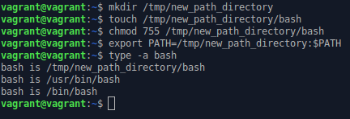

5. Ознакомьтесь с графическим интерфейсом VirtualBox, посмотрите как выглядит виртуальная машина, которую создал для вас Vagrant, какие аппаратные ресурсы ей выделены. Какие ресурсы выделены по-умолчанию?

**Ответ**: CPU - 2, ОЗУ - 1ГБ, Видеопамять - 4МБ, HDD - 64ГБ.

6. Ознакомьтесь с возможностями конфигурации VirtualBox через Vagrantfile: документация. Как добавить оперативной памяти или ресурсов процессора виртуальной машине?

**Ответ**: В конфигурационном файле `Vagrant` указываем сколько нужно ОЗУ и CPU

Пример:
```
config.vm.provider "virtualbox" do |config|
  config.memory = 2048
  config.cpus = 4
end
```

8.1. Какой переменной можно задать длину журнала history, и на какой строчке manual это описывается?

**Ответ**: переменной окружения `HISTSIZE` строки man 562-564. командой `HISTSIZE=n` либо корректировкой в файле `~/.bashrc`

8.2. Что делает директива ignoreboth в bash?

**Ответ**: Это опция переменной окружения `HISTCONTROL`, действует как 2 параметра `ignorespace` и `ignoredups`. Т.е не сохраняет строки начинающиеся с пробела и совпадающие с последней выполненной командой.

9. В каких сценариях использования применимы скобки {} и на какой строчке man bash это описано?

**Ответ**: `{ list; }` - задается список команд, должны встречаться там, где разрешено распознавать зарезервированные слова. Стр. man 186-188. Также они могут применяться как расширяющие фигурные скобки Стр. man 706-732.

10. С учётом ответа на предыдущий вопрос, как создать однократным вызовом touch 100000 файлов? Получится ли аналогичным образом создать 300000? Если нет, то почему?

**Ответ**: `touch myfile_{1..100000}.txt`. Не получится создать 300000 файлов. Будет ошибка превышения длины списка аргументов. Максимум можно создать `touch {1..147040}`

11. В man bash поищите по /\[\[. Что делает конструкция [[ -d /tmp ]]

**Ответ**: Вернет true если `/tmp` существует и это каталог

12. Основываясь на знаниях о просмотре текущих (например, PATH) и установке новых переменных; командах, которые мы рассматривали, добейтесь в выводе type -a bash в виртуальной машине наличия первым пунктом в списке:

```
bash is /tmp/new_path_directory/bash
bash is /usr/local/bin/bash
bash is /bin/bash
```

**Ответ**: 
```
mkdir /tmp/new_path_directory
touch /tmp/new_path_directory/bash
chmod 755 /tmp/new_path_directory/bash
export PATH=/tmp/new_path_directory:$PATH
```



13. Чем отличается планирование команд с помощью `batch` и `at`?

**Ответ**:
* `at` - планирует выполнение команд по времени
* `batch` - планирует выполнение команд при снижении средней нагрузки системы ниже 1,5