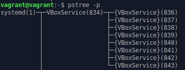
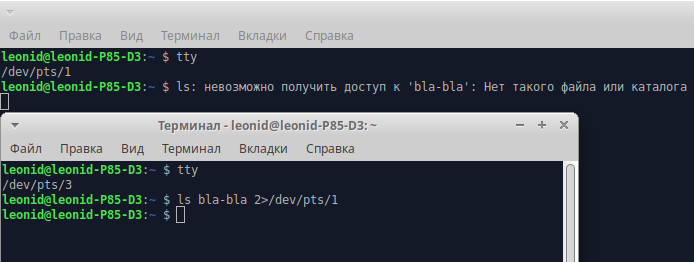
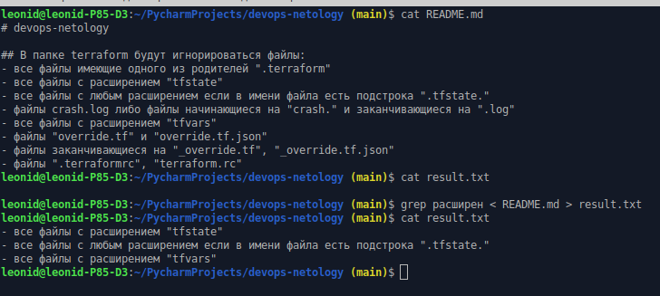
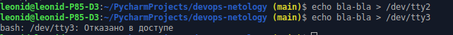
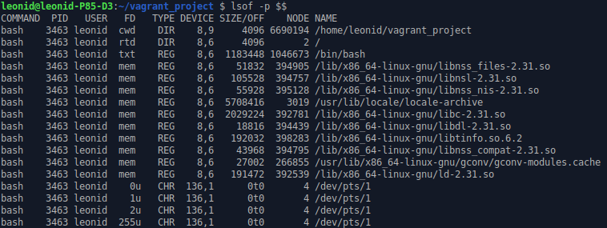
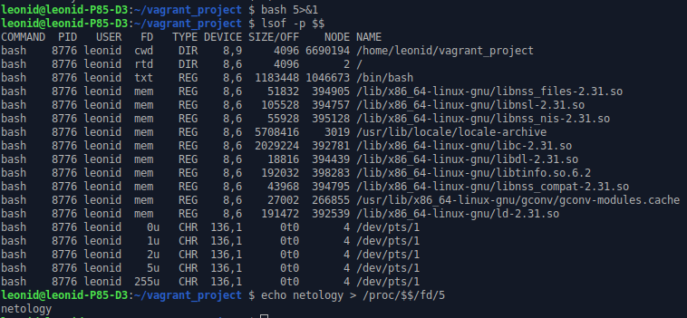
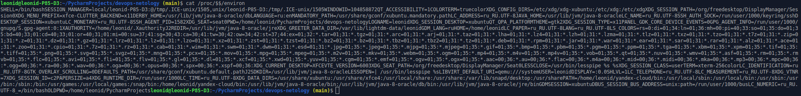

1. Какого типа команда cd? Попробуйте объяснить, почему она именно такого типа; опишите ход своих мыслей, если считаете что она могла бы быть другого типа.

**Ответ**: Это внутренняя команда (наверное команда ядра). В отличии от других команд, у неё нет исполняемых файлов
```
vagrant@vagrant:~$ whereis cd
cd:
vagrant@vagrant:~$ whereis bash
bash: /usr/bin/bash /etc/bash.bashrc /usr/share/man/man1/bash.1.gz
```
2. Какая альтернатива без pipe команде `grep <some_string> <some_file> | wc -l`? man grep поможет в ответе на этот вопрос. Ознакомьтесь с документом о других подобных некорректных вариантах использования pipe.

**Ответ**: `grep <some_string> <some_file> -c`

3. Какой процесс с PID 1 является родителем для всех процессов в вашей виртуальной машине Ubuntu 20.04?

**Ответ**: systemd - демон инициализации других демонов в Linux.



4. Как будет выглядеть команда, которая перенаправит вывод stderr `ls` на другую сессию терминала?

**Ответ**: ` ls bla-bla 2>/dev/pts/1`



5. Получится ли одновременно передать команде файл на stdin и вывести ее stdout в другой файл? Приведите работающий пример.

**Ответ**: Получится.



6. Получится ли находясь в графическом режиме, вывести данные из PTY в какой-либо из эмуляторов TTY? Сможете ли вы наблюдать выводимые данные?

**Ответ**: Получится, если предварительно залогиниться. Без логина будет ошибка "Отказано в доступе". Одновременно вводить результат и видеть как выводится в tty не получится. Чтобы увидеть результат, нужно будет заново перейти в эмулятор tty.



7. Выполните команду `bash 5>&1`. К чему она приведет? Что будет, если вы выполните `echo netology > /proc/$$/fd/5`? Почему так происходит?

**Ответ**: У нашего процесса появится новый поток с файловым дескриптором на входе 5, а на выходе с FD1. После этого всё что подается на вход этого процесса (fd5), будет выводиться stdout, на экран.

До:



После:




8. Получится ли в качестве входного потока для pipe использовать только stderr команды, не потеряв при этом отображение stdout на pty? Напоминаем: по умолчанию через pipe передается только stdout команды слева от | на stdin команды справа. Это можно сделать, поменяв стандартные потоки местами через промежуточный новый дескриптор, который вы научились создавать в предыдущем вопросе.

**Ответ**: 
```commandline
vagrant@vagrant:~$ lsof -p $$ 5>&2>&1>5 | grep pts
vagrant@vagrant:~$ lsof -p $$ 5>&2>&1>5 | grep pts
vagrant@vagrant:~$ cat trash 5>&2>&1>5 | grep pts
cat: trash: No such file or directory
vagrant@vagrant:~$ 
```

9. Что выведет команда `cat /proc/$$/environ`? Как еще можно получить аналогичный по содержанию вывод?

**Ответ**: Выведет системные переменные



Такой же результат можно получить командой `export`, только в читабельном виде.

10. Используя `man`, опишите что доступно по адресам `/proc/<PID>/cmdline`, `/proc/<PID>/exe`.

**Ответ**: 

`/proc/<PID>/cmdline`: Этот файл, доступный только для чтения, содержит полную командную строку для процесса, если только процесс не является зомби.

`/proc/<PID>/exe`:В Linux 2.2 и более поздних версиях этот файл представляет собой символическую ссылку, содержащую фактический путь к выполняемой команде.

11. Узнайте, какую наиболее старшую версию набора инструкций SSE поддерживает ваш процессор с помощью `/proc/cpuinfo`.


**Ответ**: sse4_2
```commandline
leonid@leonid-P85-D3:~ $ cat /proc/cpuinfo | grep 'SSE.{,3}' -E -i -o -w
sse
sse4_1
sse4_2
sse
sse4_1
sse4_2
sse
sse4_1
sse4_2
sse
sse4_1
sse4_2
```

12. При открытии нового окна терминала и vagrant ssh создается новая сессия и выделяется pty. Это можно подтвердить командой tty, которая упоминалась в лекции 3.2. Однако:
```commandline
vagrant@netology1:~$ ssh localhost 'tty'
not a tty
```
Почитайте, почему так происходит, и как изменить поведение.

**Ответ**: По умолчанию, когда вы запускаете команду на удаленном компьютере с помощью ssh, TTY не выделяется для удаленного сеанса. Чтобы принудительно его выделить, нужно использовать ключ -t
```commandline
vagrant@vagrant:~$ ssh localhost 'tty'
vagrant@localhost's password: 
not a tty
vagrant@vagrant:~$ ssh -t localhost 'tty'
vagrant@localhost's password: 
/dev/pts/1
Connection to localhost closed.
```

13. Бывает, что есть необходимость переместить запущенный процесс из одной сессии в другую. Попробуйте сделать это, воспользовавшись `reptyr`. Например, так можно перенести в screen процесс, который вы запустили по ошибке в обычной SSH-сессии.

**Ответ**:
* `echo 0 | sudo tee /proc/sys/kernel/yama/ptrace_scope` - временно разрешаем подключение к удаленной программе (без этой команды будет ошибка: "*The kernel denied permission while attaching. If your uid matches the target's, check the value of /proc/sys/kernel/yama/ptrace_scope*").
* Создаем продолжительный процесс `top`
* Останавливаем его `Ctrl+z`
* Отключаем задание от родителя `disown top`. В результате выполнения команды выведется PID отключенного процесса. Запоминаем его.
```commandline
vagrant@vagrant:~$ disown top
-bash: warning: deleting stopped job 1 with process group 1287
```
* Запускаем мультиплексор терминала `screen -S top`
* Подключаемся к фоновому процессу `reptyr 1287`
* Выходим `Ctrl-a d`
* Всё, можем отключаться от сессии ssh, при повторном входе и подключению к терминалу screen, мы увидим свой процесс 

14. `sudo echo string > /root/new_file` не даст выполнить перенаправление под обычным пользователем, так как перенаправлением занимается процесс shell'а, который запущен без `sudo` под вашим пользователем. Для решения данной проблемы можно использовать конструкцию `echo string | sudo tee /root/new_file`. Узнайте что делает команда `tee` и почему в отличие от `sudo echo` команда с `sudo tee` будет работать.

**Ответ**: команда `tee` считывает из *stdin* и одновременно записывает в *stdout* и в один или несколько подготовленных файлов. При это мы видим одновременно вывод результата команды. Т.к. она запущена под *sudo*, то она имеет право на изменение файла. 